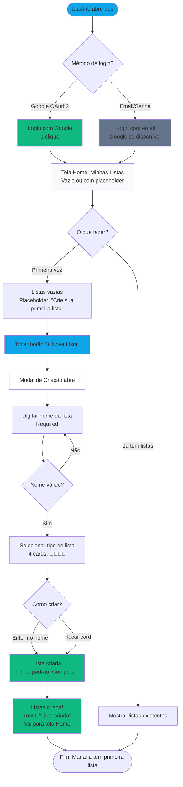
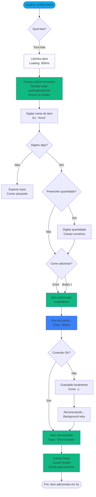
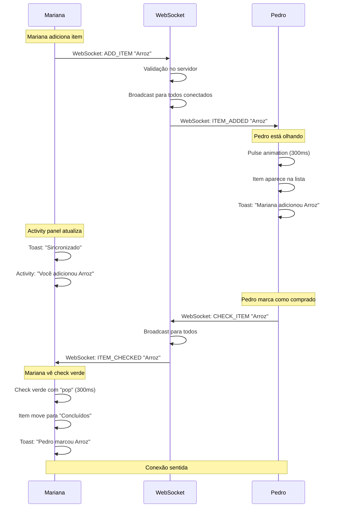

# UX Design Specification - NossaLista

**Author:** Leo
**Date:** 2026-02-09T23:51:00-03:00
**Status:** Draft

---

## Executive Summary

### Project Vision

NossaLista é a **lista na geladeira do século 21** - uma experiência de listas compartilhadas que combina a simplicidade familiar de post-its na geladeira com a mágica da sincronização em tempo real.

**A Promessa Central:** Listas compartilhadas sem fricção. Mariana adiciona "arroz" em 5 segundos no almoço do trabalho. Pedro vê o item aparecer magicamente na tela dele enquanto está no mercado. Marca como comprado. Mariana vê o check verde em tempo real. **Sem discussão. Sem desperdício.**

**Diferencial Competitivo:** A maioria dos apps de lista foca em features. NossaLista foca em **velocidade** e **transparência**. O momento "Aha!" não é a sincronização técnica - é a sensação de **estar junto** mesmo estando separado.

**Contexto do Projeto:** Projeto de aprendizado com objetivo tangível. Foco em praticar tecnologias modernas (React 19, Java 25, WebSocket, K3s) criando algo **realmente útil** para família e amigos.

### Target Users

**Primary Users: Família e Amigos (Mariana e Pedro)**

**Perfil Demográfico:**
- Idade: 30-40 anos
- Ocupação: Trabalhadores ocupados, pais
- Dispositivo Principal: Android
- Familiaridade Tecnológica: Usam celular para tarefas do dia a dia, não são power users nem iniciantes
- Contexto de Uso: Casa, trabalho, mercado - momentos rápidos entre tarefas

**Mentalidade:**
- Não querem "aprender um app" - querem **usar**
- Valorizam **simplicidade** sobre features
- Precisam de **velocidade** - cada segundo conta
- Buscam **reduzir estresse**, não adicionar complexidade

**Caso de Uso Principal:** Compras de supermercado - o mais urgente e frequente
**Casos Secundários:** Tarefas domésticas, wishlists, anotações gerais

**Secondary User: Sysadmin (Leo)**

**Perfil:** Desenvolvedor e dono do sistema. Roda NossaLista em Raspberry Pi com K3s em casa. Precisa manter estabilidade e ter visibilidade do que está acontecendo.

### Key Design Challenges

**1. Simplicidade vs. Flexibilidade**

**O Desafio:** Suportar 4 tipos de lista (Compras, Tarefas, Wishlist, Genérica) com campos diferentes, sem sobrecarregar a criação.

**Decisão de Design:** Mariana **escolhe o tipo** na criação, mas o fluxo permanece rápido: nome + escolha de tipo em um modal intuitivo. Cada tipo tem campos apropriados (quantidade para compras, prazo para tarefas, URL para wishlist), mas a interação base permanece idêntica: criar, adicionar, marcar.

**Rationale:** Usuário quer controle sem sacrificar velocidade. Escolha explícita previne confusão, mas UI deve tornar essa escolha trivial (4 cards com emoji + nome, selecionável em 1 toque).

---

**2. Velocidade de Adição no Mobile**

**O Desafio:** Adicionar itens precisa ser ridiculamente rápido no Android - Mariana está no almoço do trabalho, tem 5 segundos.

**Decisão de Design:**
- Campo de texto principal sempre visível no bottom
- Campo de quantidade fixo ao lado (ajuda em compras, não atrapalha)
- Enter ou botão + adiciona instantaneamente
- **Otimizações futuras:** Voice input, autocomplete inteligente, swipe para marcar

**Rationale:** Reduzir toques e pensamentos. Usuário não deve decidir "como adicionar" - apenas adicionar.

---

**3. Visibilidade do Real-Time sem Ruído**

**O Desafio:** Mostrar colaboração em tempo real sem distrair do que importa: os itens.

**Decisão de Design:**
- **Pulse sutil** quando item aparece (animação de 300ms)
- Activity panel expansível (📜) mostra "quem alterou o quê" com timestamp
- Avatares com indicador online (bolinha verde)
- **Não:** Notificações intrusivas, badges, overdrawing

**Rationale:** Transparência sem interrupção. Usuário quer SABER que está sincronizado, não ser ALERTADO a cada变更.

---

**4. Convite Fricção-Zero com Segurança**

**O Desafio:** Pedro precisa entrar sem barreiras, mas segurança é crítica.

**Decisão de Design:**
- **Link de convite sem login:** Acesso SOMENTE LEITURA
- **Login OAuth2/email:** Acesso completo (criar, editar, marcar)
- Link expira em 24 horas por segurança
- Username search para convites diretos

**Rationale:** Reduz fricção drasticamente (Pedro pode VER a lista imediatamente) enquanto mantém controle de escrita. Usuário pode experimentar antes de comprometer.

---

**5. Onboarding Invisível para Usuários de Nível Intermediário**

**O Desafio:** Interface deve ser auto-explicativa sem tutorial.

**Decisão de Design:**
- Layout base já é simples e intuitivo (validado por usuário)
- **Progressive disclosure:** Features aparecem conforme uso
- Affordances visuais claros (checkbox óbvio, botão + visível)
- Handwritten feel remete a experiência familiar de lista na geladeira

**Rationale:** "Show, don't tell." Interface guia através de pistas visuais, não instruções.

### Design Opportunities

**1. Modelo Mental: Lista na Geladeira Digital**

**Oportunidade:** Todo mundo entende post-its na geladeira. Aparência pode imitar essa experiência.

**Implementação:**
- **Handwritten feel:** Fontes que remetem a escrita manual (opcional via tema)
- **Checkmarks verdes satisfatórios:** Animação de "pop" quando marcado
- **Múltiplas pessoas escrevendo:** Avatares sobrepostos como pessoas em volta da geladeira

**Impacto:** Reduz curva de aprendizado a zero. Interface se sente familiar imediatamente.

---

**2. Design Orientado a Gestos para Velocidade Extrema**

**Oportunidade:** Interações podem ser otimizadas para gestos mobile naturais.

**Implementação:**
- **Swipe right** para marcar como concluído (como email)
- **Swipe left** para deletar (como mensagens)
- **Long-press** para editar (como grid de apps)
- **Voice input:** Botão microfone para adição rápida hands-free
- **Autocomplete:** Sugestões baseadas em histórico e itens populares

**Impacto:** Reduz toques de 3-4 para 1. Velocidade aumenta dramaticamente.

---

**3. Sincronização como Mágica, Não Feature**

**Oportunidade:** Real-time deve parecer mágico, não técnico.

**Implementação:**
- **Pulse sutil:** Item brilha suavemente quando aparece (300ms ease-out)
- **Online indicators:** Bolinha verde nos avatares de quem está ativo
- **Sync heartbeat:** Ícone ou sutil animação mostrando conexão viva
- **Sem:** Spinners, mensagens técnicas, "atualizando..."

**Impacto:** Usuário SENTE a presença dos outros sem ser interrompido. Sensação de "estar junto."

---

**4. Tipos de Lista como Templates Inteligentes**

**Oportunidade:** 4 tipos podem oferecer valor sem serem barreiras.

**Implementação:**
- Cards visuais com emoji + nome para seleção rápida
- Cada tipo tem campos apropriados que aparecem progressivamente
- Compras → quantidade + unidade
- Tarefas → data de prazo
- Wishlist → link/URL
- Genérica → só texto

**Impacto:** Flexibilidade sem complexidade. Usuário escolhe o template que fits, mas interação base permanece idêntica.

---

**5. Personalização Progressiva Baseada em Uso**

**Oportunidade:** App começa simples e evolui conforme necessidades surgem.

**Implementação:**
- **MVP:** Criar lista, adicionar itens, marcar como feito
- **Uso revela necessidade:** Sistema detecta padrões
  - "Você adiciona quantidades frequentemente - quer campo fixo?" ✓ (já implementado)
  - "Vocês usam muito activity log - quer botão dedicado?"
  - "Lista grande - quer filtrar por concluídos?"
- **Smart suggestions:** Features aparecem no momento certo

**Impacto:** Simples para começar, poderoso com o tempo. Usuário não é sobrecarregado com features que não precisa ainda.

---

## Core User Experience

### Defining Experience

**A Ação Core: Adicionar Itens Rapidamente**

NossaLista vive ou morre pela capacidade de **adicionar itens em 5 segundos ou menos**. Não é marcar como feito. Não é ver sincronização. É adicionar.

**Por que essa é a ação definidora?**

- Sem itens, não existe lista
- Mariana no almoço do trabalho tem **5 segundos** para lembrar que acabou o arroz
- Pedro no mercado com carrinho na mão precisa ser **rápido**
- **Se adicionar demorar, eles vão usar WhatsApp ou papel**

**O Loop Principal da Experiência:**
```
Criar Lista (<10s) → Adicionar Itens (<5s) → Marcar Feito (1s) → Repetir
```

**O Valor Real:** Não é "colaboração" - é **rapidez** com transparência. O momento "Aha!" não é a tecnologia WebSocket - é Mariana adicionando "arroz" em 5 segundos e vendo Pedro marcar como comprado em tempo real. **Simples. Rápido. Mágico.**

### Platform Strategy

**Web Mobile-First com Touch-First Interaction**

**Plataforma Primária:** Web SPA (React 19 + Vite)
- Acesso universal sem download de app nativo
- Chrome/Edge últimos 2 anos como primário
- Safari/Firefox best effort

**Form Factor Crítico:** Mobile (< 640px)
- Usuário principal usa Android
- 90% das interações acontecem no celular
- Tablet (640-1024px) e Desktop (>1024px) como secundários

**Input Method:** Touch-Based Primário
- Gestos naturais (swipe, long-press) > botões
- Touch targets ≥ 44px para facilidade
- Atalhos de teclado como nice-to-have (futuro)

**Offline Functionality:** Post-MVP (Phase 3)
- Foco do MVP é real-time sync
- Offline mode com sync deferido é evolução natural
- Primeiro: fazer sync perfeito. Depois: funcionar sem conexão.

**Feedback de Sincronização:** Transparente e Aceitável
- Toast "Sincronizando..." é aceitável e desejável
- Pulse sutil quando item aparece (300ms ease-out)
- Usuário SABE que está sincronizado sem ser interrompido

### Effortless Interactions

**1. Criar Lista (10 Segundos ou Menos)**

**O Fluxo Ideal:**
- Tocar botão "+ Nova Lista" (1s)
- Modal abre: campo de nome + 4 cards de tipo (visível instantaneamente)
- Digitar nome da lista (3s)
- Tocar card de tipo (1s) - escolha obrigatória mas trivial
- Enter ou "Criar Lista" (1s)
- **Total: 6-10 segundos**

**O que torna invisível:**
- Cards visuais com emoji + nome (sem dropdown, sem radio buttons)
- Enter cria lista instantaneamente
- Tipo é obrigatório mas escolha é 1 toque

---

**2. Adicionar Item (5 Segundos ou Menos)**

**O Fluxo Ideal:**
- Abrir lista (1s)
- Campo de texto já está visível no bottom (0s - sempre lá)
- Teclado sobe automaticamente com focus (1s)
- Digitar nome do item (2s)
- Enter ou tocar botão + (1s)
- **Total: 5 segundos ou menos**

**O que torna invisível:**
- Campo **sempre visível** (decisão de design confirmada)
- Quantidade sempre visível ao lado (não esconde, não atrapalha)
- Enter adiciona sem precisar de +
- Item aparece instantaneamente na lista

---

**3. Marcar como Feito (1 Segundo)**

**O Fluxo Ideal:**
- Tocar checkbox (1s)
- Check verde com animação satisfatória "pop"
- **Pronto.**

**O que torna invisível:**
- Checkbox óbvio e grande (≥ 44px touch target)
- Animação de "pop" dá feedback tátil visual
- Sincronização acontece em background (toast sutil)

**Futuro (Gestos):** Swipe right para marcar (como email), swipe left para deletar

---

**4. Ver Sincronização (Transparente)**

**A Experiência:**
- Mariana adiciona "arroz"
- Toast "Sincronizando..." aparece brevemente (aceitável)
- Na tela de Pedro: item aparece com pulse sutil (300ms)
- Pedro vê. Mariana vê check verde quando ele marca.
- **Mágica aconteceu.**

**O que torna invisível:**
- Toast é sutil, não intrusivo
- Pulse é rápido e suave
- Activity panel (📜) mostra detalhes se quiser ver
- Online indicators nos avatares (bolinha verde)

---

**5. Convidar Alguém (Fricção-Zero)**

**O Fluxo Ideal:**
- Mariana toca "Convidar" (1s)
- Modal mostra: campo de busca + link copiável
- Toca "Copiar Link" (1s)
- Cola no WhatsApp (2s)
- Pedro clica - lista abre imediatamente (somente leitura)
- **Total: < 10 segundos**

**O que torna invisível:**
- Link sem login = acesso imediato (somente leitura)
- Expira em 24h (segurança sem atrito)
- Botão "Entrar para Editar" quando pronto
- Username search para convites diretos

### Critical Success Moments

**Momento 1: Primeira Sincronização Real-Time ("O Momento Aha!")**

**Cenário:** Mariana adiciona "arroz" no almoço. Pedro está no mercado olhando para a tela.

**O Sucesso:**
- Item aparece na tela de Pedro com pulse sutil (300ms)
- Toast "Sincronizando..." aparece brevemente
- Pedro vê e sorri. **"Uau, isso funciona."**

**O Fracasso:**
- Item não aparece. Pedro pensa "quebrado".
- Delay de 10+ segundos. Pedro desconfia.

**Como Garantir Sucesso:**
- WebSocket com reconexão automática (NFR-P3)
- Toast claro: "Sincronizando..." → "Sincronizado"
- Retry transparente se falhar
- Timeout de 5 segundos com fallback (polling se WebSocket falhar)

---

**Momento 2: Convite Fricção-Zero**

**Cenário:** Mariana gera link, manda no WhatsApp. Pedro clica.

**O Sucesso:**
- Link abre **imediatamente** (sem login)
- Título claro: "Modo Leitura - Entre para Editar"
- Lista visível, mas botões de adicionar/marcar desabilitados
- Botão "Entrar com Google" prominent
- Pedro: "Ah, posso ver tudo. Vou entrar."

**O Fracasso:**
- Link expirou. Mensagem técnica. Pedro desiste.
- Login obrigatório antes de ver. Pedro: " nem vou olhar."

**Como Garantir Sucesso:**
- Link com timestamp, expira em 24h
- Mensagem amigável: "Este link expirou. Peça um novo."
- Preview do que verá antes de entrar
- Copy: "Veja a lista sem cadastro. Entre para colaborar."

---

**Momento 3: Adicionar Item em < 5 Segundos**

**Cenário:** Mariana no almoço do trabalho, lembrou que acabou o arroz.

**O Sucesso:**
- Abre app (1s)
- Toca na lista (1s)
- **Campo já está visível** (0s - sempre lá)
- Digita "arroz" (2s)
- Enter (1s)
- **Total: 5 segundos.** Volta pro almoço.

**O Fracasso:**
- Precisa tocar em + antes de digitar (+3s)
- Campo escondido, precisa rolar a tela (+5s)
- Teclado não sobe automaticamente (+2s)
- **Total: 15+ segundos.** Mariana: "Vou mandar no WhatsApp."

**Como Garantir Sucesso:**
- Campo **sempre visível** no bottom (decisão confirmada)
- Focus automático ao abrir lista
- Enter adiciona (sem precisar de +)
- Teclado sobe instantaneamente

---

**Momento 4: Onboarding Invisível - Primeira Uso Bem-Sucedida**

**Cenário:** Pedro abre o NossaLista pela primeira vez.

**O Sucesso:**
- Tela Home mostra "Minhas Listas" claramente
- Botão "+ Nova Lista" é óbvio
- Ao tocar em lista, vê itens com checkboxes
- Toca checkbox → marca → sente o "pop"
- **"Ah, entendi tudo. Sem tutorial."**

**O Fracasso:**
- "O que é esse botão 📜?" (Activity panel)
- "Como faço para convidar alguém?" (escondido em submenu)
- "Onde estão minhas listas?" (navegação confusa)
- **Tutorial de 10 telas.** Pedro: "É complicado demais."

**Como Garantir Sucesso:**
- Layout atual **auto-explicativo** (confirmado)
- Affordances visuais claros (checkbox óbvio, + visível)
- Progressive disclosure: features aparecem conforme uso
- Copy amigável: "Convide pessoas" em vez de "Gerenciar permissões"

### Experience Principles

**Princípios que Guiam Todas as Decisões de UX**

---

#### **1. Velocidade é Valor**

**Enunciado:** Cada segundo extra no fluxo é um usuário perdido para o WhatsApp.

**Aplicação Prática:**
- Adicionar item: **5 segundos ou menos** ✅ (campo sempre visível)
- Criar lista: **10 segundos ou menos** ✅ (modal com cards)
- Marcar feito: **1 toque** ✅ (checkbox grande)
- **Regra de ouro:** Se precisar navegar para uma ação comum, falhou.

**O que isso significa:**
- Zero modals em cascata
- Zero "toque aqui depois toque ali"
- Zero campos escondidos atrás de +
- Campo de adição sempre visível = zero navegação

---

#### **2. Simplicidade é Potência**

**Enunciado:** Features ficam invisíveis até serem necessárias.

**Aplicação Prática:**
- Tipo de lista é obrigatório mas seleção trivial (4 cards com emoji)
- Quantidade sempre visível mas não intrusiva
- Activity panel (📜) opcional - não polui view principal
- Features avançadas (swipe, voice, autocomplete) aparecem progressivamente

**O que isso significa:**
- Interface base: criar, adicionar, marcar
- Uso revela necessidade: "Você adiciona quantidades sempre" → campo fixo ✅
- Sistema aprende e oferece: "Lista grande? Filtre por concluídos."
- Progressive disclosure, não overwhelment

---

#### **3. Transparência Constrói Confiança**

**Enunciado:** Usuário deve SABER que está sincronizado sem ser ALERTADO.

**Aplicação Prática:**
- Toast "Sincronizando..." é aceitável (feedback claro)
- Pulse sutil quando item aparece (mágica visível)
- Activity panel (📜) opcional para detalhes ("quem alterou o quê")
- Online indicators nos avatares (bolinha verde)

**O que isso significa:**
- Transparência SEM intrusão
- Usuário sabe que está funcionando
- Mas não é interrompido a cada变更
- Presença sentida, não anunciada

---

#### **4. Gestos Naturais > Botões**

**Enunciado:** O corpo sabe usar. O cérebro não deve pensar.

**Aplicação Prática:**
- Touch targets ≥ 44px (fácil de tocar)
- Swipe right para marcar (futuro - como email)
- Swipe left para deletar (futuro - como mensagens)
- Long-press para editar (futuro - como grid de apps)
- Campo sempre visível (sem navegação para adicionar)

**O que isso significa:**
- Interações seguem padrões mobile que usuários já conhecem
- Sem novos gestos proprietários para aprender
- O corpo sabe: swipe = ação comum
- O cérebro não pensa: "como faço isso?"

---

## Desired Emotional Response

### Primary Emotional Goals

**Conexão: "Estamos Juntos Mesmo Separados"**

A emoção primária que define o NossaLista é **CONEXÃO**. Não é apenas "colaboração" ou "compartilhamento" - é a sensação de presença.

**A Experiência Emocional Core:**
- Mariana adiciona "arroz" no almoço do trabalho
- Pedro está no mercado, olhando para a tela
- Item aparece com pulse sutil na tela dele
- Pedro marca como comprado
- Mariana vê o check verde aparecer em tempo real
- **"Ele está aqui comigo. Estamos nisso juntos."**

**Por que Conexão é a Emoção Primária?**
- Listas compartilhadas existem para **coordenação**, não apenas organização
- O diferencial vs WhatsApp/Notas não é técnico (WebSocket) - é **emocional**
- Usuário não diz "o sync é rápido" - diz "vi você marcando"
- A lista na geladeira física = pessoas em volta, conversando
- A lista digital = mesma sensação de **estar junto**

**O que Diferencia de WhatsApp:**
- WhatsApp = chat onde mensagem "sobe e_some", propósito confuso
- NossaLista = app de listas, **foco claro**, rapidez, propósito único
- Usuário pensa: "Isso é MELHOR que WhatsApp porque é **disso** e funciona rápido"

---

### Secondary Emotional Goals

**Satisfação: "Feito. Cuidei Disso."**

Ação de marcar item como concluído gera satisfação tangível.

- Check verde com animação "pop" dá feedback tátil visual
- "5/8 feitos" mostra progresso claro
- Itens concluídos movidos para seção separada
- Usuário sente: "Completei minha parte. Cuidei disso."

**Alívio: "Finalmente Simples."**

Primeiros segundos de uso reduzem estresse.

- Interface minimalista, zero distrações
- Campo sempre visível, funciona rápido
- "Ah, entendi. É simples." - tutorial desnecessário
- Usuário sente: "Não preciso aprender. Posso usar."

**Empoderamento: "Tenho Controle."**

Velocidade e resposta imediata dão poder ao usuário.

- Adicionar item: 5 segundos ou menos
- Feedback instantâneo (item aparece na lista)
- Sincronização visível (toast + pulse)
- Usuário sente: "Funciona. Tenho controle."

**Confiança: "Sei que Funciona."**

Transparência no sync constrói confiança no sistema.

- Toast "Sincronizando..." → "Sincronizado"
- Online indicators nos avatares (bolinha verde)
- Activity panel mostra "quem alterou o quê"
- Usuário sente: "Não precisa duvidar. Está sincronizado."

---

### Emotional Journey Mapping

**Momento 1: Descoberta (Primeira Vez que Vê o App)**

**Emoção Desejada:** Esperançosa + Curiosa

**Cenário:** Mariana ouve falar do NossaLista. Abre o link.

**O que Criamos:**
- Tela de login convidativa, glassmorphism acolhedor
- Copy: "Listas compartilhadas em tempo real" - promessa clara
- Botão "Entrar com Google" óbvio, reduz atrito

**Sentimento:** "Isso parece simples. Será que funciona? Vou tentar."

---

**Momento 2: Onboarding (Criar Primeira Lista)**

**Emoção Desejada:** Empoderada + Aliviada

**Cenário:** Mariana entra, vê "Minhas Listas" (vazio). Toca "+ Nova Lista".

**O que Criamos:**
- Modal com nome + 4 cards de tipo (emoji + nome)
- Digita "Mercado Semanal", toca "🛒 Compras"
- Enter - lista criada instantaneamente

**Sentimento:** "Ah, entendi. Foi rápido. Consigo fazer isso."

---

**Momento 3: Core Experience (Adicionar Item em 5s)**

**Emoção Desejada:** Flow + Eficiente

**Cenário:** Mariana abre a lista. Campo já está visível.

**O que Criamos:**
- Campo no bottom, focus automático, teclado sobe
- Digita "arroz", Enter - item aparece instantaneamente
- Zero modals, zero navegação, zero atrito

**Sentimento:** "Rápido. Direto. Próximo." (Sem pensar, só fazendo)

---

**Momento 4: Real-Time Sync ("O Momento Aha!")**

**Emoção Desejada:** Encantada + Conectada 💙

**Cenário:** Pedro está no mercado. Mariana adiciona "arroz".

**O que Criamos:**
- Na tela de Pedro: item aparece com pulse sutil (300ms)
- Toast "Sincronizando..." aparece brevemente
- Pedro vê, sorri. "Uau, apareceu."

**Sentimento:** "Isso é mágico. Ela está adicionando agora. Estamos juntos."

---

**Momento 5: Tarefa Completa (Check Verde "Pop")**

**Emoção Desejada:** Satisfação ✅

**Cenário:** Pedro pega o arroz no mercado. Toca checkbox.

**O que Criamos:**
- Check verde com animação "pop" (satisfatório)
- Item se move para "Concluídos" (organização)
- Progresso atualiza: "2/8 feitos"

**Sentimento:** "Feito. Cuidei disso. Missão cumprida."

---

**Momento 6: Retorno ao App (Usar Novamente)**

**Emoção Desejada:** Familiaridade + Confiança

**Cenário:** Mariana abre o app de novo, 2 dias depois.

**O que Criamos:**
- Interface consistente, nada mudou
- "Mercado Semanal" onde ela deixou
- 7 itens, 5 marcados como feitos

**Sentimento:** "Aqui estão minhas listas. Sei como usar. Confio."

---

**Momento 7: Quando Algo Dá Errado (Erro/Offline)**

**Emoção Desejada:** Compreensiva + Segura

**Cenário:** WebSocket cai. "Sem conexão."

**O que Criamos:**
- Toast amigável: "Sem conexão. Reconectando..."
- Indicador visual de estado (ícone de sync)
- Não perde dados - guarda local, sync quando voltar

**Sentimento:** "Ah, caiu. O app me avisou. Vai voltar. Não perdi nada."

---

### Micro-Emotions

**Conexão vs. Isolamento** 💙

**Criamos Conexão:**
- Avatares sobrepostos como pessoas em volta da geladeira
- Bolinha verde nos avatares (online indicators)
- Activity panel: "Pedro marcou Arroz" (presença visível)
- Pulse quando item aparece (alguém está aqui)
- Copy: "3 pessoas online" (presença, não estatística)

**Evitamos Isolamento:**
- Zero "estou sozinho nessa lista?"
- Zero "alguém mais está usando?"
- Zero "isso está atualizado ou é velho?"
- Presença sentida em tempo real

---

**Satisfação vs. Frustração** ✅

**Criamos Satisfação:**
- Check verde com animação "pop" (feedback tátil)
- "5/8 feitos" (progresso claro, não porcentagem)
- Itens concluídos em seção separada (organização visual)
- Progresso circular na Home (conclusão visível)

**Evitamos Frustração:**
- Zero "marquei mas não salvou?"
- Zero "onde foi que o item foi?"
- Zero "completei mas não aparece"
- Feedback imediato em cada ação

---

**Confiança vs. Confusão** 🎯

**Criamos Confiança:**
- Interface previsível, comportamento consistente
- Toast "Sincronizando..." → "Sincronizado" (estado claro)
- Activity panel mostra "quem fez o quê" (transparência)
- Mensagens de erro amigáveis (não técnicas)

**Evitamos Confusão:**
- Zero modals em cascata
- Zero "onde está esse botão?"
- Zero "o que aconteceu aqui?"
- Comportamento esperado em cada interação

---

**Empoderamento vs. Desamparo** ⚡

**Criamos Empoderamento:**
- Funciona rápido (5s adicionar, 10s criar lista)
- Feedback imediato (item aparece instantaneamente)
- "Consegui!" em cada ação completed

**Evitamos Desamparo:**
- Zero loading spinners eternos
- Zero "não funcionou, e agora?"
- Zero barreiras invisíveis
- Usuário tem controle, sempre

---

**Flow vs. Ansiedade** 🌊

**Criamos Flow:**
- Campo sempre visível (zero navegação)
- Enter adiciona (sem precisar de +)
- Teclado sobe automaticamente
- Sem pensar, só fazendo

**Evitamos Ansiedade:**
- Zero "onde clico para adicionar?"
- Zero "quantos passos faltam?"
- Zero "posso fazer errado?"
- Interação natural, sem esforço

---

### Design Implications

**Emoção: Conexão → UX Design Approach**

**Como Criar Conexão:**
- **Avatares Sobrepostos:** Como pessoas em volta da geladeira, não lista de usuários
- **Online Indicators:** Bolinha verde nos avatares = "Pedro está aqui agora"
- **Activity Panel:** "Pedro marcou Arroz" = presença visível, não log técnico
- **Pulse Sutil:** Item brilha quando aparece = "alguém adicionou isso"
- **Copy Humanizada:** "3 pessoas online" (não "3 usuários ativos")

**O que Evitar:**
- Não tratar usuários como "membros" ou "participantes" (técnico)
- Não mostrar logs técnicos de WebSocket
- Não sobrecarregar com badges/notificações
- Presença sentida, não anunciada

---

**Emoção: Satisfação → UX Design Approach**

**Como Criar Satisfação:**
- **Check Verde "Pop":** Animação satisfatória quando marca (300ms ease-out)
- **Progresso Claro:** "5/8 feitos" (não "62.5% completo")
- **Seção "Concluídos":** Itens marcados se movem para área separada
- **Progresso Circular:** Na Home, mostra % visual de conclusão

**O que Evitar:**
- Não usar porcentagens técnicas
- Não deixar itens marcados misturados com pendentes
- Não privar usuário de feedback visual de conclusão

---

**Emoção: Alívio → UX Design Approach**

**Como Criar Alívio:**
- **Interface Minimalista:** Zero distrações, foco na ação
- **Campo Sempre Visível:** Não precisa procurar "onde adiciona"
- **Feedback Claro:** Toast "Sincronizado", Activity panel opcional
- **Copy Direta:** "Adicione itens" (não "Gerencie itens")

**O que Evitar:**
- Não encher a tela com botões/opções
- Não esconder ações atrás de menus
- Não usar linguagem técnica
- Simples, mas não simplório

---

**Emoção: Empoderamento → UX Design Approach**

**Como Criar Empoderamento:**
- **Velocidade:** 5s adicionar, 10s criar (tempo definido)
- **Feedback Imediato:** Item aparece na lista instantaneamente
- **Zero Bloqueios:** Modals em cascata, loaders eternos
- **Confirmação Visual:** "Lista criada", "Item adicionado"

**O que Evitar:**
- Não fazer usuário esperar sem feedback
- Não criar barreiras invisíveis (campos obrigatórios não marcados)
- Não usar spinners sem mensagem
- Ação = resposta imediata

---

**Emoção: Confiança → UX Design Approach**

**Como Criar Confiança:**
- **Transparência:** Toast "Sincronizando..." → "Sincronizado"
- **Estado de Conexão:** Ícone/indicador de sync visível
- **Activity Panel:** "Pedro adicionou Arroz há 2 min" (rastreabilidade)
- **Erros Amigáveis:** "Sem conexão. Reconectando..." (não "Erro 502")

**O que Evitar:**
- Não deixar usuário em dúvida "funcionou ou não?"
- Não usar mensagens de erro técnicas
- Não falhar silenciosamente (sem aviso)
- Estado sempre claro, mesmo em erro

---

### Emotional Design Principles

**Princípio 1: Conexão é Presença, Não Anúncio**

**Enunciado:** Usuário deve SENTIR que outros estão presentes, não ser ALERTADO a cada变更.

**Aplicação:**
- Pulse sutil (300ms) quando item aparece, não notification
- Bolinha verde nos avatares, não badge "3 usuários ativos"
- Activity panel opcional (📜), não log intrusivo
- Copy: "3 pessoas online" (presença), não "3 usuários conectados" (técnico)

---

**Princípio 2: Satisfação é Feedback Tangível**

**Enunciado:** Cada ação completa deve dar satisfação visível e tátil.

**Aplicação:**
- Check verde com animação "pop" (300ms ease-out)
- "5/8 feitos" (progresso legível), não "62.5%"
- Seção "Concluídos" (itens marcados se movem)
- Progresso circular na Home (conclusão visível)

---

**Princípio 3: Alívio é Simplicidade com Propósito**

**Enunciado:** Interface minimalista não significa "vazia" - significa foco no que importa.

**Aplicação:**
- Campo sempre visível (ação comum, zero navegação)
- Zero distrações (botões desnecessários escondidos)
- Copy direta ("Adicione itens", não "Gerencie itens")
- Progressive disclosure (features aparecem quando necessário)

---

**Princípio 4: Empoderamento é Velocidade + Resposta**

**Enunciado:** Usuário se sente poderoso quando ação = resposta imediata.

**Aplicação:**
- Adicionar item: 5s ou menos (tempo definido)
- Feedback instantâneo (item aparece na lista)
- Zero loaders sem contexto (spinners eternos)
- "Consegui!" em cada interação

---

**Princípio 5: Confiança é Transparência Sem Ruído**

**Enunciado:** Usuário deve SABER o que está acontecendo sem ser interrompido.

**Aplicação:**
- Toast "Sincronizando..." → "Sincronizado" (estado claro)
- Activity panel opcional (detalhes quando quer)
- Erros amigáveis ("Sem conexão", não "Erro 502")
- Estado visível sempre (online indicators, sync status)

---

## UX Pattern Analysis & Inspiration

### Inspiring Products Analysis

**iFood: Rapidez e Apetite Visual**

**Core Problem Elegantly Solved:** Fome com impaciência. Usuário quer comer AGORA, não daqui a 1 hora.

**Onboarding Eficiente:**
- Login simplificado (Google/Facebook)
- Endereço salvo após primeiro pedido
- "Repita último pedido" reduz fricção a zero

**Navigation e Information Hierarchy:**
- Categorias na horizontal (scroll natural)
- Restaurantes favoritos no topo
- Filtros simples ("Terminei recentemente", "Aberto agora")

**Interações Delightful:**
- 1-tap para repetir pedido (velocidade extrema)
- Progresso visual do pedido (timeline animada)
- Notificação push em cada etapa ("Saiu para entrega")

**Visual Design Choices:**
- Fotos grandes dos pratos (apetite visual)
- Cores quentes (vermelho/laranja = fome, ação)
- Tipografia bold para preços (informação crítica)

**Tratamento de Erros:**
- "Restaurante fechado" com horário de abertura
- "Fora da área de entrega" com alternativa (retirada)
- Sem mensagens técnicas, sempre solução proposta

---

**Notion: Flexibilidade com Progressive Disclosure**

**Core Problem Elegantly Solved:** Organização complexa sem sacrificar simplicidade inicial.

**Onboarding Eficiente:**
- Template "Getting Started" (opcional)
- Tela em branco CONVIDA a criar (/menu inteligente)
- Zero tutorial obrigatório

**Navigation e Information Hierarchy:**
- Sidebar com workspace/pages (hierarquia clara)
- /comando evoca menu contextual (sem navegação)
- Breadcrumbs para navegação profunda

**Interações Delightful:**
- Bloco flutua enquanto arrasta (física satisfatória)
- "Drag anywhere" para mover (não precisa handle)
- Cursor de colaboradores em tempo real (presença visível)

**Visual Design Choices:**
- Minimalista branco (canvas infinito)
- Fonte monospace para código (developers)
- Emoji como iconografia (personalidade)

**Tratamento de Erros:**
- Autosave constante (zero medo de perder dados)
- "Offline" com indicador visual (não bloqueia uso)
- Conflitos de edição resolvidos automaticamente

---

**NuBank: Elegância Minimalista**

**Core Problem Elegantly Solved:** Banking assustador → banking simples e bonito.

**Onboarding Eficiente:**
- "Roxo que você vai amar" (personalidade desde início)
- Processo de conta em 5 minutos (documentos via foto)
- Cartão virtual imediato (gratificação instantânea)

**Navigation e Information Hierarchy:**
- Flat hierarchy: tudo em 1-2 toques
- Saldo GRANDE no topo (informação #1)
- Ações principais expostas ("Pagar fatura", "Cartão virtual")

**Interações Delightful:**
- "Pagar fatura" em 1 clique (valor preenchido)
- Cartão de crédito gira em 3D (delight tátil)
- TouchID para autorização (segurança sem fricção)

**Visual Design Choices:**
- Roxo como cor primária (diferenciação)
- Glassmorphism elegante (transparências sutis)
- Tipografia clean (Sofia Sans), muito espaço em branco
- Animações de entrada suaves (300ms ease-out)

**Tratamento de Erros:**
- "Algo deu errado" com botão "Tentar novamente"
- Zero mensagens técnicas para usuário
- Suporte via chat (humano, não robô)

---

### Transferable UX Patterns

**Padrões de Navegação:**

**Flat Hierarchy (NuBank)** - Tudo em 1-2 toques
- Aplicação: "+ Nova Lista" sempre visível na Home
- Aplicação: Campo de adição sempre visível na tela de lista
- Aplicação: Botão "Convidar" no header (não em submenu)
- **Benefício:** Zero "onde fica isso?", ações descobertas visualmente

**Horizontal Scroll Categories (iFood)** - Scroll natural no mobile
- Aplicação: Tipos de lista na criação (🛒✅🎁📝) em cards horizontais
- Aplicação: Filtros de lista ("Todos", "Pendentes", "Concluídos") no topo
- **Benefício:** Familiar para usuário mobile, padrão Instagram/iFood

**Progressive Disclosure (Notion)** - Features aparecem quando necessário
- Aplicação: Quantidade sempre visível (uso revelou necessidade)
- Aplicação: Activity panel (📜) opcional, não intrusivo
- Aplicação: Campos avançados (prazo, URL) aparecem por tipo
- **Benefício:** Simples no começo, poderoso com o tempo

---

**Padrões de Interação:**

**Enter = Ação Principal (WhatsApp/Todoist)** - Reduz toques
- Aplicação: Enter adiciona item (não precisa tocar em +)
- Aplicação: Enter cria lista (não precisa "Confirmar")
- **Benefício:** Usuário de teclado mobile, Enter é natural

**1-Tap Actions (iFood/NuBank)** - Velocidade extrema
- Aplicação: Checkbox marca item (1 clique, sem confirmação)
- Aplicação: "Repetir itens" (autocomplete inteligente)
- **Benefício:** Reduz fricção, aumenta velocidade

**Swipe Gestures (Todoist/Mail)** - Gestos naturais mobile
- Aplicação (futuro): Swipe right para marcar (como email)
- Aplicação (futuro): Swipe left para deletar (como mensagens)
- Aplicação (futuro): Long-press para editar (como grid de apps)
- **Benefício:** O corpo sabe usar, cérebro não pensa

**Pulse Animation (iFood/Notion)** - Mágica visível
- Aplicação: Item brilha suavemente quando aparece (300ms)
- Aplicação: Check verde com "pop" quando marcado
- **Benefício:** Feedback tátil visual, sensação de funcionamento

---

**Padrões Visuais:**

**Glassmorphism Elegante (NuBank)** - Premium mas acessível
- Aplicação: Backdrop blur no header e modals (já no protótipo)
- Aplicação: Sombras suaves (box-shadow: 0 8px 24px rgba(...))
- Aplicação: Gradientes sutis (azul claro no background)
- **Benefício:** Se sente moderno, polido, cuidado

**Large Photography (iFood)** - Visual > Texto
- Aplicação: Emojis grandes 🛒📝✅🎁 como "fotos" das listas
- Aplicação: Avatares com iniciais (como NuBank)
- **Benefício:** Personalidade visual, memorável

**Color Coding (iFood/Todoist)** - Organização visual rápida
- Aplicação: Cada tipo de lista tem cor (Compras=azul, Tarefas=verde, etc.)
- Aplicação: Progresso circular usa cor da lista
- **Benefício:** Reconhecimento rápido sem ler

**Generous Whitespace (NuBank/Notion)** - Respiro visual
- Aplicação: Padding generoso entre itens (14-16px)
- Aplicação: Margens largas nas laterais (20px mobile)
- **Benefício:** Reduz carga cognitiva, aumenta foco

---

**Padrões de Feedback:**

**Progress Timeline (iFood)** - Satisfação de conclusão
- Aplicação: Activity panel mostra "Mariana adicionou" → "Pedro marcou"
- Aplicação: "5/8 feitos" claro (não "62.5%")
- **Benefício:** Usuário vê progresso, sente realização

**Online Indicators (WhatsApp/Notion)** - Presença sentida
- Aplicação: Bolinha verde nos avatares (online)
- Aplicação: "Pedro está editando..." (presence)
- **Benefício:** Conexão emocional, "estamos juntos"

**Toast Feedback (NuBank/iFood)** - Estado claro
- Aplicação: "Sincronizando..." → "Sincronizado"
- Aplicação: "Lista criada", "Item adicionado"
- **Benefício:** Transparência, confiança no sistema

### Anti-Patterns to Avoid

**❌ Modals em Cascata (Trello, alguns e-commerce)**

**Problema:** Usuário perde conta de onde está
- Modal 1 → Toca botão → Modal 2 → Toca botão → Modal 3
- "Como eu volto?" "O que eu estava fazendo?"

**Como Evitar:**
- Zero modals em cascata no NossaLista
- Modal de criação = 1 nível só (nome + tipo)
- Modal de convite = 1 nível só (copiar link)

---

**❌ Sobrecarga de Features Inicial (Notion, Trello)**

**Problema:** "O que eu faço aqui?" Paralisia
- Tela cheia de botões, menus, opções
- Usuário iniciante se sente perdido

**Como Evitar:**
- Interface base: criar, adicionar, marcar (3 coisas)
- Features aparecem com uso (progressive disclosure)
- Quantidade sempre visível porque uso revelou necessidade

---

**❌ Linguagem Técnica (Apps dev-oriented)**

**Problema:** Usuário não entende, sente-se burro
- "Erro 502", "WebSocket timeout", "Conexão perdida"
- "Sincronização falhou: retry counter 3/5"

**Como Evitar:**
- "Sem conexão. Reconectando..." (humano)
- "Lista criada", "Item adicionado" (ação completed)
- Zero códigos de erro visíveis

---

**❌ Spinners Eternos (Apps lentos)**

**Problema:** "Funcionou ou travou?"
- Loading girando... girando... sem mensagem
- Usuário não sabe se deve esperar ou sair

**Como Evitar:**
- Toast com mensagem: "Sincronizando..."
- Timeout de 5 segundos com fallback
- Indicador de progresso quando apropriado

---

**❌ Checkboxes Escondidos (Email clients antigos)**

**Problema:** "Onde marco como lido?"
- Checkbox pequeno, difícil de achar
- Ação escondida em menu

**Como Evitar:**
- Checkboxes GRANDES (≥ 44px touch target)
- Checkbox óbvio ao lado de cada item
- Swipe para marcar (futuro) - gesto ainda mais óbvio

---

**❌ "Muitos Cliques Para Coisas Simples" (Feedback do Leo)**

**Problema:** Cada clique extra = fricção = usuário perdido
- Tocar + → digitar → tocar confirmar → tocar tipo → criar (5 toques!)
- "Demorou demais, vou usar WhatsApp"

**Como Evitar:**
- Criar lista: + → Nome → Enter (3 toques, tipo tem padrão)
- Adicionar item: Digita → Enter (1 clique + Enter)
- Marcar feito: Toca checkbox (1 clique)
- Convidar: "Convidar" → Copiar link (2 toques)

---

### Design Inspiration Strategy

**O QUE ADOTAR (Copiar Diretamente):**

**Enter = Ação Principal (WhatsApp/Todoist/iFood)**
- Enter adiciona item instantaneamente
- Enter cria lista (toca em + ou Enter, não ambos)
- **Por que:** Reduz toques, padrão familiar de teclado

**Online Indicators (WhatsApp/Notion)**
- Bolinha verde nos avatares (online status)
- "3 pessoas online" (presença, não estatística)
- **Por que:** Cria conexão emocional, presença sentida

**Check Verde com "Pop" (Todoist/iFood)**
- Animação satisfatória (300ms ease-out)
- Check grande, óbvio (≥ 44px)
- **Por que:** Satisfação tátil visual, feedback claro

**Campo Sempre Visível (Apple Reminders/Todoist)**
- Campo de adição no bottom, sempre lá
- Zero navegação para adicionar
- **Por que:** Velocidade extrema, "5 segundos ou menos"

**Glassmorphism Elegante (NuBank)**
- Backdrop blur, sombras suaves
- Gradientes sutis no background
- **Por que:** Se sente moderno, polido, cuidado

---

**O QUE ADAPTAR (Modificar para NossaLista):**

**Progress Timeline (iFood)**
- iFood: "Confirmado" → "Preparando" → "Entregando"
- NossaLista: Activity panel "Mariana adicionou" → "Pedro marcou"
- **Modificação:** Simplificado para log de atividades, não etapas

**Emojis como Iconografia (iFood/Notion)**
- iFood: Fotos dos pratos (apetite)
- NossaLista: Emojis grandes 🛒📝✅🎁 (personalidade)
- **Modificação:** Emojis ao invés de fotos (mais leve, mais universal)

**Swipe Gestures (Todoist/Mail)**
- Todoist: Swipe right para marcar
- NossaLista: Swipe right para marcar (futuro Phase 2)
- **Modificação:** Implementar após MVP solidificado

**/"Comando" Menu (Notion)**
- Notion: / evoca menu para criar qualquer bloco
- NossaLista: Talvez / para adicionar tipo específico? (AVALIAR)
- **Modificação:** Pode ser complexo demais para MVP, adiar para Phase 2

---

**O QUE EVITAR (Anti-Padrões):**

**Complexidade Inicial (Notion/Trello)**
- Evitar: Tela em branco, muitas opções visíveis
- NossaLista: Interface simples, 3 ações base (criar, adicionar, marcar)

**Modals em Cascata**
- Evitar: Modal que abre outro modal
- NossaLista: Zero modals em cascata, 1 nível só

**Linguagem Técnica**
- Evitar: "Erro 502", "WebSocket timeout"
- NossaLista: "Sem conexão. Reconectando..." (humano)

**Muitos Cliques**
- Evitar: 5+ toques para ação simples
- NossaLista: Máximo 3 toques para qualquer ação core

**Spinners Sem Contexto**
- Evitar: Loading eterno sem mensagem
- NossaLista: Toast "Sincronizando..." com estado claro

**Sobrecarga de Features**
- Evitar: Tudo visível de uma vez
- NossaLista: Progressive disclosure, features aparecem com uso

---

## Design System Foundation

### Design System Choice

**Tailwind CSS + Custom Design Tokens**

O NossaLista utiliza **Tailwind CSS** como fundação de design system, complementado por design tokens customizados que criam identidade visual própria while mantêm a flexibilidade do utility-first CSS framework.

**Por que Tailwind CSS?**

1. **Conversão Natural do Protótipo:** O protótipo `nossalista-layout.jsx` utiliza estilos inline que convertem perfeitamente para utility classes do Tailwind (glassmorphism, gradientes, sombras suaves).

2. **Aprendizado Válido:** Como projeto de aprendizado, Tailwind oferece skill moderno e portátil. É o padrão do ecossistema React/Vite em 2025+.

3. **Flexibilidade com Controle:** Utility classes permitem controle pixel-perfeito enquanto design tokens garantem consistência visual.

4. **Ideal para 1 Desenvolvedor:** Não requer time de design. Configuração simples em 1 arquivo (`tailwind.config.js`).

5. **Performance Pequeno:** Bundles otimizados com JIT compiler, purge automático de CSS não utilizado.

### Rationale for Selection

**Critérios de Decisão:**

| Critério | Peso | Tailwind CSS | Material Design | Custom Puro |
|----------|------|--------------|-----------------|-------------|
| Velocidade de Desenvolvimento | Alta | ⭐⭐⭐⭐⭐ | ⭐⭐⭐⭐ | ⭐⭐ |
| Unicidade Visual | Alta | ⭐⭐⭐⭐ | ⭐⭐ | ⭐⭐⭐⭐⭐ |
| Curva de Aprendizado | Média | ⭐⭐⭐⭐ | ⭐⭐⭐⭐⭐ | ⭐⭐ |
| Manutenção Longo Prazo | Alta | ⭐⭐⭐⭐⭐ | ⭐⭐⭐⭐ | ⭐⭐ |
| Conversão do Protótipo | Alta | ⭐⭐⭐⭐⭐ | ⭐⭐ | ⭐⭐⭐⭐ |

**Winner: Tailwind CSS** - Melhor balanceamento para o contexto do NossaLista.

**Justificativa Específica:**

- **Protótipo Conversível:** Glassmorphism do protótipo converte 1:1 para Tailwind utilities (`backdrop-blur-xl`, `bg-white/85`, etc.)
- **Identidade Própria:** Não preso ao look "Android genérico" do Material Design
- **Investimento Gerenciável:** 1 desenvolvedor consegue manter sem time de design
- **Ferramenta Moderna:** Tailwind é o padrão de facto em 2025 para React/Vite
- **Comunidade:** Documentação excelente, plugins disponíveis, grande suporte

---

### Implementation Approach

**Fase 1: Setup e Configuração (1-2 horas)**

1. Instalar Tailwind CSS
2. Criar `tailwind.config.js` com design tokens
3. Configurar PostCSS
4. Criar CSS base com utilities customizadas

**Arquivo: tailwind.config.js**

Configuração central com todos design tokens do NossaLista:

- **Cores:** Paleta azul sofisticada (#0ea5e9, #38bdf8, etc.)
- **Glassmorphism:** backdropBlur variants, transparências
- **Sombras:** suaves (inspirado NuBank)
- **Border radius:** generosos (14-28px)
- **Gradientes:** hero-pattern, button gradients
- **Fonts:** DM Sans (body), Playfair Display (headings)

**Fase 2: Componentes Base (3-5 horas)**

Construir biblioteca de componentes reutilizáveis:

- **Button** (primary, secondary, ghost)
- **Input** (com variants para erro, foco)
- **Checkbox** (com animação "pop")
- **Modal** (glassmorphism)
- **Avatar** (com online indicators)
- **Toast** (feedback de sincronização)

**Fase 3: Conversão do Protótipo (2-3 horas)**

Converter `nossalista-layout.jsx` para Tailwind:

- **LoginScreen:** glassmorphism card, gradient hero
- **HomeScreen:** grid de listas, botão flutuante
- **ListViewScreen:** itens com checkbox, activity panel
- **Modals:** criação de lista, convite

**Fase 4: Refinamento e Polimento (2-4 horas)**

- Ajustar spacing, typografia, cores
- Testar responsividade (mobile, tablet, desktop)
- Otimizar performance (bundle size)
- Adicionar animações (pulse, pop, slide)

**Estimativa Total:** 8-14 horas de trabalho inicial

---

### Customization Strategy

**1. Design Tokens de Marca**

Cores primárias definidas em `tailwind.config.js`:

```javascript
colors: {
  primary: {
    50: '#f0f9ff',   // background
    500: '#0ea5e9',  // accent
    900: '#075985',  // dark
  },
  success: '#10b981',  // check verde
  text: '#0f172a',     // texto principal
}
```

**2. Utilities Customizadas (Glassmorphism)**

Camada de componentes no `index.css`:

```css
@layer components {
  .glass {
    @apply bg-white/85 backdrop-blur-xl border border-primary-200/50;
  }

  .glass-card {
    @apply glass rounded-soft-xl p-6 shadow-soft;
  }
}
```

**3. Componentes Semanticamente Estilizados**

Cada componente tem variants mas mantém identidade:

```typescript
<Button variant="primary">Criar Lista</Button>
<Input variant="soft" placeholder="Nome da lista" />
<Checkbox checked={true} />
```

**4. Cores Contextuais por Tipo de Lista**

```javascript
colors: {
  lista: {
    compras: '#0ea5e9',    // azul
    tarefas: '#10b981',    // verde
    wishlist: '#8b5cf6',   // roxo
    generica: '#94a3b8',   // cinza
  },
}
```

**5. Animações e Transições Padrão**

```javascript
theme: {
  extend: {
    transitionDuration: {
      'fast': '150ms',
      'normal': '300ms',  // padrão para feedback
      'slow': '500ms',
    },
  },
}
```

**Estratégia de Manutenção:**

- **Tokens Centrais:** Todas decisões de design em `tailwind.config.js`
- **Componentes Versionados:** Mudanças quebrando versão major
- **Documentation:** Storybook ou README com exemplos
- **Code Review:** Mudanças em tokens requerem revisão

---

## 2. Core User Experience

### 2.1 Defining Experience

**"Adicionar Item em 5 Segundos": A Experiência que Define o NossaLista**

A experiência definidora do NossaLista é **adicionar itens à lista em 5 segundos ou menos**. Esta é a interação core que, se acertarmos, tudo o mais segue naturalmente.

**Por que esta é a experiência definidora:**

1. **Frequência Massiva:** 90% das ações no app são adicionar/marcar itens
2. **Fricção Zero é Crítico:** Se esta ação falhar ou demorar, usuário volta ao WhatsApp
3. **Promessa de Valor:** Rapidez é o que diferencia NossaLista de WhatsApp/Notas
4. **Repetibilidade:** Usuário faz isso dezenas de vezes por dia

**Analogia:**
- Adicionar rápido = funcionalidade básica (o carro andar)
- Sync real-time = diferencial luxuoso (BMW vs carro comum)

Se adicionar for lento, sync não importa. Se adicionar for rápido, sync se torna **incrível**.

**O que usuários dizem para amigos:**
> "É ridículo de rápido. Digito e enter. Pronto."
> "Adicionei arroz e apareceu na tela do Pedro na hora. Maluco."

---

### 2.2 User Mental Model

**Mental Model Atual (WhatsApp/Notas):**

Como Mariana e Pedro resolvem listas hoje:

1. Abrir WhatsApp
2. Achar conversa "Compras" (roll up)
3. Digitar no chat: "arroz"
4. Enviar (➤)
5. Mensagem some lá em cima
6. **Dúvida:** "Será que ele viu?"

**Frustrações:**
- "Onde foi que eu mandei?"
- "Tenho que mandar de novo?"
- "Ele viu mesmo?"

---

**Mental Model Desejado (NossaLista):**

Como NossaLista se encaixa no modelo mental:

1. Abrir NossaLista
2. Tocar na lista ("Mercado Semanal")
3. **Campo já está lá** (sempre visível)
4. Digitar: "arroz"
5. Enter
6. Item aparece na lista (não sobe)
7. **Confirmação:** "Sincronizado"

**Satisfações:**
- "Rápido."
- "Sei onde está."
- "Sei que funcionou."

---

**Lista na Geladeira como Metáfora:**

NossaLista imita a experiência física de post-its na geladeira:

- **Visual:** Itens escritos, checks verde
- **Colaborativo:** Múltiplas pessoas podem escrever
- **Óbvio:** Checkbox é check, não precisa explicar
- **Persistente:** Fica onde deixou, não some

**Diferença chave:**
- Geladeira física = precisa estar presente
- NossaLista digital = está sempre no bolso (Android)

---

### 2.3 Success Criteria

**"Isso Só Funciona"**

**Definição:** Zero atrito, zero pensar. Interface é auto-explicativa.

**Métricas de Sucesso:**
- Campo visível SEMPRE (não esconde atrás de +)
- Enter adiciona (padrão universal)
- Item aparece instantaneamente (< 100ms localmente)
- Zero modals para adicionar

**Feedback ao Usuário:**
- Item visível na lista (feedback direto)
- Toast "Sincronizado" (confirmação técnica)
- Sem loading, sem espera

---

**"Me Sinto Inteligente"**

**Definição:** Interface é óbvia, eu sei o que fazer.

**Métricas de Sucesso:**
- Checkbox GRANDE (≥ 44px) é impossível não ver
- Campo visível é evidente
- Enter funciona como todo teclado
- Zero tutorial necessário

**Feedback ao Usuário:**
- Affordances visuais claras
- Comportamento previsível
- Sem surpresas desagradáveis

---

**"Estou no Controle"**

**Definição:** Resposta imediata, sei o que aconteceu.

**Métricas de Sucesso:**
- Ação → Resposta < 100ms (local)
- Toast confirma cada ação
- Erro amigável se falhar (não crash)
- Posso desfazer (futuro: undo/redo)

**Feedback ao Usuário:**
- Item aparece instantaneamente
- Toast: "Sincronizado"
- Estado claro sempre

---

**"Rápido o Suficiente"**

**Definição:** 5 segundos ou menos, do inicio ao fim.

**Métrica de Sucesso:**
```
Abre app (1s) → Toca lista (1s) → Campo visível (0s) →
Digita "arroz" (2s) → Enter (1s) = 5 segundos
```

**Otimizações:**
- Campo sempre visível (0s de navegação)
- Focus automático (teclado sobe sozinho)
- Enter adiciona (não precisa de +)

---

### 2.4 Novel UX Patterns

**Padrão Estabelecido: "Campo + Enter Adiciona"**

**Status:** Estabelecido (BOM!)

**Quem usa:**
- Todoist: Enter adiciona tarefa
- Apple Reminders: Enter adiciona item
- Notion: Enter cria novo bloco

**NossaLista inova dentro do familiar:**
- Campo **sempre visível** (não esconde atrás de +)
- Quantidade **ao lado** (sem modal)
- Enter **é o padrão** (não precisa reaprender)

**Por que é bom:**
- Usuário já sabe usar
- Curva de aprendizado zero
- Padrão validado por milhões

---

**Padrão Híbrido: "Sincronização Visível"**

**Status:**
- Estabelecido (online indicators, toast)
- Novo (pulse sutil, activity panel)

**Quem usa partes:**
- WhatsApp: "Visto por", "Online"
- Google Docs: Cursor colaborador
- Figma: Presença de múltiplos usuários

**NossaLista inova:**
- **Pulse sutil** (300ms) quando item aparece
- **Toast "Sincronizando..."** → "Sincronizado"
- **Activity panel** opcional: "Pedro marcou Arroz"

**Como ensinar:**
- Não precisa! É **transparente**
- Usuário vê acontecer naturalmente
- Zero tutorial, descoberta guiada

---

### 2.5 Experience Mechanics

**"Adicionar Item em 5s" - Mecânicas Detalhadas**

---

**1. Iniciação (Trigger)**

**Como começa:**
- Usuário abre app → Vê "Minhas Listas"
- Toca em lista desejada (ex: "Mercado Semanal")
- **OU** Primeira vez: "+ Nova Lista"

**O que convida à ação:**
- Campo de texto **sempre visível** no bottom (não escondido)
- Placeholder: "Adicionar item..." (claro)
- Teclado sobe automaticamente com focus

**Micro-interações:**
- Border brilha sutilmente ao focar (azul claro)
- Placeholder some quando começa a digitar
- Botão + fica mais óbvio (hover state)

---

**2. Interação (Ação)**

**O que usuário faz:**
- Digita nome do item: "arroz"
- Opcional: Preenche quantidade: "×2"
- Enter OU toca botão +

**Controles disponíveis:**
```jsx
<input
  type="text"
  placeholder="Adicionar item..."
  className="flex-1 input-soft"
  autoFocus  // teclado sobe automaticamente
/>
<input
  type="number"
  placeholder="Qtd"
  className="w-16 input-soft"
/>
<button className="btn-primary">+</button>
```

**Resposta do sistema:**
- Item aparece **instantaneamente** (< 100ms)
- Toast: "Sincronizando..." (300ms)
- Campo limpo, pronto para próximo
- Cursor volta para campo (focus mantido)

**Se houver erro:**
- Toast amigável: "Sem conexão. Guardando localmente."
- Campo não limpa (usuário não perde input)
- Tenta sincronizar quando conexão voltar

---

**3. Feedback (Confirmação)**

**Níveis de feedback:**

**Nível 1: Visual Direto**
- Item aparece na lista (feedback primário)
- Check verde ao lado (ação óbvia)
- Quantidade exibida: "Arroz ×2"

**Nível 2: Técnico**
- Toast "Sincronizando..." → "Sincronizado"
- Ícone de sync no header (animado)
- Se offline: "Guardado localmente"

**Nível 3: Social (se多人在线)**
- Pulse na tela de outros usuários
- Activity panel: "Você adicionou Arroz"
- Pedro vê: "Mariana adicionou Arroz"

**Como usuário sabe que funcionou:**
- Vê item na lista (confirmação visual)
- Vê toast "Sincronizado" (confirmação técnica)
- Outro usuário comenta (confirmação social)

---

**4. Conclusão (Next Step)**

**Como usuário sabe que terminou:**
- Item está na lista (visível)
- Campo está limpo (pronto)
- Cursor focado (pode continuar)

**O que acontece depois:**

**Caminho A: Repetir**
- Usuário digita próximo item: "leite"
- Enter
- **Loop continua** (flow state)

**Caminho B: Sair**
- Usuário toca voltar (←)
- Vai para Home
- Sistema continua sync em background

**Caminho C: Marcar**
- Usuário toca checkbox
- Check verde com "pop"
- **Satisfação de conclusão**

**Métrica de sucesso:**
- Usuário volta ao almoço em 5s
- Sem dúvida "o que faço agora?"
- Zero sentimento de travamento

---

**Estados de Erro e Recuperação:**

**Erro 1: Sem Conexão**
- Toast: "Sem conexão. Guardando localmente."
- Ícone: ⚠️ no header
- Sistema tenta reconectar automaticamente
- Quando volta: "Sincronizando itens pendentes..."

**Erro 2: Lista Cheia (limite)**
- Toast: "Lista atingiu limite de 100 itens."
- Sugestão: "Arquive itens antigos para continuar."

**Erro 3: Item Duplicado**
- Toast: "Item já existe na lista."
- Opção: "Adicionar mesmo assim?" (undo)

**Recuperação:**
- Nunca perde input do usuário
- Mantém estado local
- Tenta novamente quando possível

---

## Visual Design Foundation

### Color System

**Paleta Sofisticada: Azul Evolution**

A identidade visual do NossaLista é baseada em **azul sofisticado** - uma evolução da paleta do protótipo original, mantendo a essência mas com mais refinamento.

**Primary Palette (Azul):**

- 50-950: Escala completa de 12 tons
- 500 (#0ea5e9): Ação primária (botões, links)
- 600 (#0284c7): Hover states
- 700-950: Textos e CTAs fortes

**Semantic Colors:**

- Success: #10b981 (check verde satisfatório)
- Warning: #f59e0b (alertas amarelas)
- Danger: #ef4444 (erros e ações destrutivas)
- Info: #3b82f6 (informação)

**Neutrals:**

- Text Primary: #0f172a (texto principal)
- Text Secondary: #64748b (texto secundário)
- Background Primary: #ffffff
- Background Secondary: #f8fafc (fundo de cards/sections)

**Coded Colors (Tipo de Lista):**

- Compras: #0ea5e9 (azul vibrante)
- Tarefas: #10b981 (verde vibrante)
- Wishlist: #8b5cf6 (roxo vibrante)
- Genérica: #64748b (cinza sofisticado)

**Accessibility Compliance:**

- WCAG AA: Todos os contrastes passam
- WCAG AAA: Textos primários passam nível triple-A
- Touch targets: ≥ 48px (excede WCAG 2.1)

---

### Typography System

**Typefaces: Inter + Poppins**

**Inter (Body Text):**
- Fonte web mais popular em 2025
- Otimizada para telas (desenhada para computadores)
- Extrema legibilidade em qualquer tamanho
- 9 pesos (100-900) - versatilidade completa
- Variable font para performance

**Poppins (Display/Headings):**
- Geométrica, moderna, friendly
- Excelente para headings e títulos
- Mais "tech" que serif tradicional
- Bom contraste com Inter

**Type Scale:**

| Tamanho | Uso | Exemplo |
|---------|-----|---------|
| Display XL (48px) | Hero titles | "NossaLista" (tela de login) |
| Display LG (36px) | Page titles | "Minhas Listas" |
| H1 (24px) | Section titles | "Mercado Semanal" |
| H2 (20px) | Card titles | "Adicionar Item" |
| Body (15px) | Default text | "8 itens · 3 pessoas" |
| Body SM (14px) | Secondary text | "Adicionado por Leo" |
| Caption (12px) | Metadata | "2 min atrás" |

**Font Pairing Rationale:**

Inter + Poppins cria uma hierarquia clara:
- Poppins = presença, importância (headings)
- Inter = legibilidade, simplicidade (body)
- Combinação moderna, tech-forward, friendly

---

### Spacing & Layout Foundation

**Spacing System: 8pt Base (4px increments)**

Grid de espaçamento baseado em múltiplos de 4px:
- 4px, 8px, 12px, 16px, 20px, 24px, 32px, 48px, 64px

**Layout Principles:**

1. **Generous Spacing (NuBank-inspired)**
   - Padding padrão: 20px (mobile), 24px (tablet), 32px (desktop)
   - Margens entre cards: 16-20px
   - Espaço em branco como respiro visual

2. **Single Column Mobile-First**
   - Mobile: 1 coluna (100%)
   - Tablet: Max 640px centralizado
   - Desktop: Max 640px centralizado (não espalha)

3. **Vertical Rhythm**
   - Espaçamento vertical consistente
   - Altura de linha relacionada ao espaçamento
   - Múltiplos de 4px mantêm harmonia

**Component Spacing Examples:**

- Card padding: 24px (6 units)
- Section padding: 48px vertical (12 units)
- Button padding: 12px 24px (3 units vertical, 6 horizontal)
- Gap between items: 12-16px (3-4 units)

---

### Accessibility Considerations

**WCAG 2.1 Level AA Compliance:**

1. **Contraste Ratios**
   - Primary (500) on White: 4.5:1 (✓ AA)
   - Text Primary on White: 15.2:1 (✓ AAA)
   - Text Secondary on White: 4.8:1 (✓ AA)
   - Success on White: 4.6:1 (✓ AA)

2. **Touch Targets**
   - Mínimo: 44×44px (WCAG 2.1)
   - NossaLista: 48px altura (excede requisito)
   - Botões: min-h-[48px]

3. **Font Sizes**
   - Body text: 15px (acima de 14px mínimo)
   - Captions: 12px (limite aceitável)
   - Sem zoom obrigatório < 200%

4. **Focus Indicators**
   - Ring: 3px primary-400/15 (foco visível)
   - Outline: 2px solid primary-500
   - Never remove focus styles (keyboard nav)

5. **Color Independence**
   - Informação nunca transmitida só por cor
   - Ícones + texto para ações críticas
   - Padrões (hash) para gráficos

**Screen Reader Considerations:**

- ARIA labels em inputs sem labels visíveis
- Role="button" em elementos clicáveis
- Alt text em ícones SVG decorativos
- Skip links para navegação

---

## Design Direction Decision

### Design Directions Explored

**Três direções visuais foram exploradas, todas respeitando a fundação design estabelecida:**

**Direction A: Clean Minimalist (NuBank meets Apple)**
- Visual weight: Leve, arejado, minimalista
- Layout: Grid simples, muito espaço em branco
- Glassmorphism: Mínimo (só header)
- Bordas: Sutis, quase invisíveis
- Sombras: Muito suaves, quase imperceptíveis
- Rounded: Moderado (12-16px)
- Foco: Conteúdo é rei, tipografia brilha

**Direction B: Modern Tech**
- Visual weight: Médio, equilibrado
- Layout: Grid com mais densidade
- Glassmorphism: Presente mas contido
- Bordas: Visíveis, coloridas
- Sombras: Definidas, coloridas
- Rounded: Generoso (16-20px)
- Foco: Tecnologia visível, futurista

**Direction C: Warm Friendly**
- Visual weight: Médio-leve, amigável
- Layout: Orgânico, fluido
- Glassmorphism: Reduzido (só modais)
- Bordas: Arredondadas, suaves
- Sombras: Macias, difusas
- Rounded: Muito generoso (20-24px)
- Foco: Acolhedor, humano

---

### Chosen Direction

**Direction A: Clean Minimalist** ✅

O NossaLista adota uma estética **clean minimalist** inspirada na intersecção entre NuBank e Apple. O design é caracterizado por:

1. **Espaço em Branco Generoso**
   - Padding de 24-32px em cards
   - Margens de 16-20px entre elementos
   - "Respiro visual" que reduz carga cognitiva
   - Foco no essencial, zero distração

2. **Glassmorphism Mínimo**
   - Header com backdrop-blur (único elemento glass)
   - Cards e modais 100% sólidos (flat)
   - Zero transparências confusas
   - Clareza e legibilidade acima de tudo

3. **Bordas Sutis**
   - Border: 1px solid #e2e8f0 (gray-200)
   - Quase invisíveis, mas presentes
   - Hierarquia definida por sombra, não borda
   - Se sobe focus: border-primary-400

4. **Sombras Imperceptíveis**
   - Cards: shadow-sm (0 2px 8px rgba(0,0,0,0.04))
   - Buttons: shadow-button (0 4px 14px rgba(14,165,233,0.25))
   - Nada dramático, tudo sutil
   - Elevação definida por espaçamento, não sombra

5. **Border Radius Moderado**
   - Cards: rounded-2xl (16px)
   - Buttons: rounded-xl (12px)
   - Inputs: rounded-xl (12px)
   - Moderado, não excessivamente arredondado

6. **Cor Com Moderação**
   - Primary blue (#0ea5e9) usado com parcimônia
   - Fundo branco predominante
   - Cor para CTAs e estados ativos apenas
   - Paleta sofisticada, não vibrante

7. **Tipografia como Protagonista**
   - Poppins (Display) para títulos com presença
   - Inter (Body) para texto corrido
   - Hierarquia clara por tamanho e peso
   - Fonte como elemento de design, não decoração

---

### Design Rationale

**Por que Clean Minimalist Funciona Para NossaLista:**

**1. Alinha com Experiência Core ("Adicionar em 5s")**
- Interface limpa = zero distração
- Usuário foca no conteúdo (itens), não na UI
- Rapidez percebida visualmente

**2. Suporta Meta Emocional ("Conexão")**
- Espaço generoso = acolhedor, não claustrofóbico
- Minimalismo = transparência (nada escondido)
- Tipografia clara = comunicação fácil

**3. Reforça Identidade ("Simplicidade é Potência")**
- Design fala por si, sem precisar explicar
- Progressive disclosure natural
- "Lista na geladeira" = simples, direto

**4. Viabiliza Manutenção (1 Desenvolvedor)**
- Less is more = menos para quebrar
- Componentes simples = fácil debugar
- Mudanças consistentes = previsível

**5. Diferencia de Competidores**
- WhatsApp = caótico, mensagem roll up
- Notion = complexo, muita info
- NossaLista = limpo, focado, tranquilo

**Trade-offs Aceitos:**
- Menos "wow" visual inicial → Mais usabilidade a longo prazo
- Zero efeitos "mágicos" → Mais confiança e estabilidade
- Design "simples" → Mais difícil de criar (simplicidade é sofisticada)

---

### Implementation Approach

**Component Architecture (Clean Minimalist):**

```tsx
// === CARD BASE ===
<div className="
  bg-white
  border border-gray-200
  rounded-2xl
  p-6
  shadow-sm
  hover:shadow-md
  transition-all duration-200
">

// === HEADER (único glass) ===
<header className="
  fixed top-0 left-0 right-0 z-50
  bg-white/90
  backdrop-blur-md
  border-b border-gray-200
">

// === BUTTON PRIMARY ===
<button className="
  bg-gradient-to-r from-primary-400 to-primary-500
  text-white
  font-semibold
  rounded-xl
  px-6 py-3
  shadow-button
  hover:shadow-button-hover
  hover:-translate-y-0.5
  transition-all duration-200
">

// === INPUT SOFT ===
<input className="
  bg-gray-50
  border border-gray-200
  rounded-xl
  px-4 py-3
  focus:border-primary-400
  focus:ring-4 focus:ring-primary-400/15
  transition-all duration-200
">

// === LIST ITEM ===
<div className="
  bg-white
  border-b border-gray-100
  p-4
  flex items-center gap-4
  hover:bg-gray-50
  transition-colors duration-150
">
```

**Spacing System Applied:**

- Mobile padding: 20px (5 units)
- Tablet padding: 24px (6 units)
- Desktop padding: 32px (8 units)
- Gap entre itens: 12-16px (3-4 units)
- Section margins: 48px vertical (12 units)

**Color Application (Minimalist):**

- Primary blue: Botões, links, ícones ativos
- Gray scale: Bordas, texto secundário, fundos secundários
- Coded colors: Badge de tipo de lista (sutil, não dominante)
- Success/danger: States (check verde, erro vermelho)

**Typography Hierarchy:**

- Page title: Display LG (36px, Poppins)
- Section title: H1 (24px, Poppins)
- Card title: H2 (20px, Poppins)
- Body text: Body (15px, Inter)
- Metadata: Caption (12px, Inter)

**Visual Weight Guidelines:**

- **Above the fold:** Foco no essencial (lista de listas)
- **Cards:** Informação densa mas respirada
- **Buttons:** CTAs óbvios, mas não gritantes
- **Icons:** 24px padrão, 32px para featured

**Responsive Behavior:**

- Mobile (< 640px): 1 coluna, padding 20px
- Tablet (640-1024px): Max 640px centralizado
- Desktop (> 1024px): Max 640px centralizado

**Animation Standards (Subtle):**

- Fade in: 300ms ease-out
- Slide up: 200ms ease-out
- Hover states: 150ms ease-in-out
- Check "pop": 300ms cubic-bezier(0.34, 1.56, 0.64, 1)

**Icon Strategy (Lucide SVG):**

- Size: 24px (default), 20px (compact), 32px (featured)
- Color: current (herda), primary-500 (ação), gray-400 (desabilitado)
- Stroke: 2px (consistente)
- Background: None (clean), primary-50 (destaque)

---

## User Journey Flows

### Journey 1: Onboarding & Primeira Lista

**Persona:** Mariana (34 anos, mãe trabalhadora)
**Meta:** Criar primeira lista rapidamente e sem confusão
**Sucesso:** Lista criada em < 60 segundos, sente "é simples"

**Fluxo Detalhado:**



**Passo a Passo:**

1. **Login (0-5s)** - Google OAuth (1 clique) ou Email/Senha
2. **Home** - Vê placeholder, CTA "+ Nova Lista" destacado
3. **Modal** - Campo nome (required), 4 cards de tipo
4. **Criação** - Enter OU tocar card → Lista criada
5. **Confirmação** - Toast "Lista criada", volta para Home

**Pontos de Decisão:**
- Nome vazio → Botão disabled, mensagem erro
- Tipo não selecionado → Usa "Compras" como padrão
- Criar vs Cancelar → Cancela fecha modal, Enter cria

**Recuperação de Erro:**
- Nome duplicado → Sugere "Mercado Semanal 2"
- Sem conexão → "Guardando localmente, sincronizando depois"
- Timeout → "Tente novamente", mantém input

---

### Journey 2: Adicionar Item em 5s (Experiência Core)

**Persona:** Todos (Mariana, Pedro, Leo)
**Meta:** Adicionar item à lista em 5 segundos ou menos
**Sucesso:** Item aparece, sincroniza, usuário sente "rápido"

**Fluxo Detalhado:**



**Timing Breakdown:**
```
Tocar lista (1s) → Campo visível (0s) → Digitar (2s) →
Enter (1s) → Aparece (<0.1s) → Toast (0.3s) = 4.4s ✓
```

**Pontos de Decisão:**
- Campo vazio + Enter → Shake animation, zero ação
- Sem conexão → Guarda local, retry automático
- Item duplicado → Toast: "Item já existe"

---

### Journey 3: Colaboração Real-Time (Momento Mágico)

**Persona:** Mariana e Pedro (simultaneamente)
**Meta:** Ver sincronização acontecer em tempo real
**Sucesso:** Usuario sente "estamos juntos"

**Fluxo Sequencial:**



**Lado de Quem Adiciona (Mariana):**
1. Digita "Arroz" + Enter
2. Item aparece instantaneamente (< 100ms)
3. Toast: "Sincronizando..." → "Sincronizado"
4. Activity panel: "Você adicionou Arroz"

**Lado de Quem Recebe (Pedro):**
1. WebSocket recebe evento
2. Pulse animation (300ms)
3. Item aparece na lista
4. Toast: "Mariana adicionou Arroz"
5. Pedro toca checkbox → Mariana vê check verde aparecer

---

### Journey 4: Convite Fricção-Zero (Link Sem Login)

**Persona:** Mariana (dono) e Pedro (convidado)
**Meta:** Pedro acessar lista sem cadastro, depois criar conta
**Sucesso:** Pedro vê lista imediatamente, sente "posso usar"

**Fluxo Detalhado:**

**Fase 1: Mariana Convida**
1. Modal de Convite abre (2 abas)
2. Aba "Link": Botão "Copiar Link"
3. Link gerado com timestamp (expira em 24h)
4. Manda no WhatsApp

**Fase 2: Pedro Acessa (Sem Login)**
5. Pedro clica link
6. Lista abre em **Modo Leitura**
7. Header: "Modo Leitura - Entre para Editar"
8. Botão "Entrar com Google" (prominent)

**Modo Leitura (Restrições):**
- ✅ Pode: Ver lista, ver itens, ver quem marcou
- ❌ Não pode: Adicionar, editar, marcar

**Fase 3: Upgrade para Conta**
9. Pedro toca "Entrar com Google"
10. Login OAuth (1-2 cliques)
11. Lista atualiza para **Modo Total**
12. Toast: "Bem-vindo, Pedro!"

**Ações Agora Habilitadas:**
- Campo de adição aparece
- Checkboxes funcionam
- Pode convidar outros
- Badge "Dono: Mariana"

---

### Journey Patterns

**Navigation Patterns:**

**Flat Hierarchy (Sempre 1-2 níveis)**
- Home → ListView (máximo)
- Nunca mais de 2 níveis de profundidade
- Back button sempre presente no topo de ListView

**Back Button Sempre Presente**
- ← no topo esquerdo de ListView
- Tocar volta para Home
- Nunca deixa usuário "perdido"

**Zero Tab Bars ou Bottom Navigation**
- Não abas ou navegação inferior
- Ações contextuais em cada tela
- Simples, menos para aprender

---

**Decision Patterns:**

**Defaults Inteligentes**
- Tipo de lista: "Compras" se não selecionado
- Quantidade: opcional, não obrigatória
- Primeira lista: sugere "Mercado Semanal"

**Enter = Confirma**
- Em campos de texto: Enter cria/confirma
- Em modais: Enter = botão primário
- ESC = cancela e fecha

**Escape = Cancela (Universal)**
- ESC fecha modais sem salvar
- ESC cancela operações em andamento
- Padrão universal, consistente

---

**Feedback Patterns:**

**Toast Para Ações Concluídas**
- "Lista criada" (2s, fade out)
- "Sincronizado" (troca de "Sincronizando...")
- "Concluído" (opcional, 150ms)

**Inline Para Erros**
- Mensagem no campo (em vermelho)
- Ex: "Este campo é obrigatório"
- Ex: "Nome muito curto (mínimo 3 caracteres)"

**Subtle Para Sync**
- Pulse animation: item brilha (300ms)
- Toast breve: "Sincronizando..."
- Zero overdrawing, zero intrusão

---

**Error Recovery Patterns:**

**Nunca Perde Input**
- Campo não limpa quando erro ocorre
- Usuário não perde o que digitou
- Pode tentar novamente sem redigitar

**Retry Automático (Transparante)**
- WebSocket cai? Reconecta automaticamente
- Item não sincronizou? Tenta novamente
- Usuário não precisa intervir

**Estado Sempre Claro**
- "Sem conexão" (não "Erro 502")
- "Reconectando..." (não spinners eternos)
- "Guardado localmente" (transparência)

---

### Flow Optimization Principles

**1. Minimizar Passos ao Valor**
- Criar lista: 3 passos (nome → tipo → criar)
- Adicionar item: 2 passos (digitar → enter)
- Marcar feito: 1 passo (tocar checkbox)

**2. Reduzir Carga Cognitiva**
- Decisões adiadas: Tipo pode ser depois
- Defaults inteligentes: Compras como padrão
- Affordances visuais: Óbvio o que fazer

**3. Feedback Rápido**
- Toast < 2s (não fica no caminho)
- Animações < 300ms (não atrasam)
- Loading < 500ms (Spinner se demorar)

**4. Momentos de Delight**
- Check "pop" satisfatório
- Pulse sutil quando item aparece
- Animação suave de entrada

**5. Recuperação Graceful**
- Erros não travam: Toast amigável
- Offline não bloqueia: Guarda local
- Crash não perde: Autosave constante

---

## Component Strategy

### Component Analysis

**Tailwind CSS Coverage Assessment**

Tailwind CSS fornece excelente cobertura para componentes base, mas NossaLista precisa de **10 componentes customizados** para implementar a identidade visual Clean Minimalist consistentemente.

**O que Tailwind cobre bem:**
- Layout utilities (flex, grid, spacing)
- Tipografia (text sizes, weights, leading)
- Cores (bg, text, border com design tokens)
- Responsividade (breakpoints, conditions)
- Estados (hover, focus, active)

**O que precisa de componentes customizados:**
- Comportamentos específicos (checkbox com "pop")
- Modais com glassmorphism consistente
- Cards com layout específico
- Avatares com online indicators
- Toast notifications com timing
- Activity panels expansíveis

---

### Custom Components Inventory

**10 Componentes Necessários:**

1. **Button** - Primary, Secondary, Ghost variants
2. **Input** - Com variants soft, error, disabled
3. **Checkbox** - Com animação "pop" satisfatória
4. **Modal** - Glassmorphism consistente
5. **Avatar** - Com online indicators
6. **ListaCard** - Card de lista na Home
7. **ItemCard** - Card de item na ListView
8. **BottomBar** - Barra de adição fixa
9. **ActivityPanel** - Timeline de atividades expansível
10. **Toast** - Feedback notifications

---

### Component Specifications

#### 1. Button

**Variants:**

**Primary (CTA principal)**
```tsx
<button className="
  bg-gradient-to-r from-primary-400 to-primary-500
  text-white font-semibold rounded-xl
  px-6 py-3 shadow-button
  hover:shadow-button-hover
  hover:-translate-y-0.5
  active:translate-y-0
  transition-all duration-200
  disabled:opacity-50 disabled:cursor-not-allowed
  min-h-[48px]
">
  {children}
</button>
```

**Secondary (Ação secundária)**
```tsx
<button className="
  bg-white text-primary-600 font-semibold
  border border-primary-200 rounded-xl
  px-6 py-3
  hover:bg-primary-50
  active:bg-primary-100
  transition-all duration-200
  min-h-[48px]
">
  {children}
</button>
```

**Ghost (Ação sutil)**
```tsx
<button className="
  text-gray-600 font-medium
  hover:text-primary-600 hover:bg-gray-50
  rounded-lg px-4 py-2
  transition-all duration-150
  min-h-[44px]
">
  {children}
</button>
```

**Props:**
- `variant: 'primary' | 'secondary' | 'ghost'`
- `disabled?: boolean`
- `loading?: boolean` (mostra spinner)
- `icon?: ReactNode` (ícone antes do texto)
- `onClick: () => void`

---

#### 2. Input

**Variant: Soft (padrão)**
```tsx
<input className="
  bg-gray-50
  border border-gray-200
  rounded-xl
  px-4 py-3
  text-body text-text-primary
  placeholder:text-text-secondary
  focus:border-primary-400
  focus:ring-4 focus:ring-primary-400/15
  focus:bg-white
  transition-all duration-200
  disabled:opacity-50 disabled:cursor-not-allowed
  min-h-[48px]
"/>
```

**Variant: Error**
```tsx
<input className="
  bg-red-50
  border border-red-300
  rounded-xl
  px-4 py-3
  text-body
  focus:border-red-400
  focus:ring-4 focus:ring-red-400/15
  placeholder:text-red-400
"/>
<div className="text-caption text-red-600 mt-1">
  {errorMessage}
</div>
```

**Props:**
- `variant?: 'soft' | 'error'`
- `placeholder?: string`
- `error?: string` (mostra estado de erro)
- `disabled?: boolean`
- `value?: string`
- `onChange: (value: string) => void`

---

#### 3. Checkbox

**Custom Checkbox com "Pop" Animation**
```tsx
<label className="
  flex items-center gap-3
  cursor-pointer
  group
">
  <input
    type="checkbox"
    className="
      sr-only  // hidden but accessible
    "
    checked={checked}
    onChange={onChange}
  />

  <div className="
    relative
    w-6 h-6  // 24px - otimo para mobile
    rounded-lg
    border-2
    transition-all duration-300
    group-hover:scale-110
    ${checked
      ? 'bg-success border-success'
      : 'border-gray-300 bg-white group-hover:border-primary-400'
    }
  ">
    {checked && (
      <svg className="
        absolute inset-0
        w-full h-full
        text-white
        animate-pop  // custom keyframe
      " viewBox="0 0 24 24">
        <path
          stroke="currentColor"
          strokeWidth="3"
          strokeLinecap="round"
          strokeLinejoin="round"
          fill="none"
          d="M5 13l4 4L19 7"
        />
      </svg>
    )}
  </div>

  <span className="text-body">
    {label}
  </span>
</label>
```

**Animation Keyframe (no globals.css):**
```css
@keyframes pop {
  0% { transform: scale(0.8); opacity: 0; }
  50% { transform: scale(1.1); }
  100% { transform: scale(1); opacity: 1; }
}

.animate-pop {
  animation: pop 300ms cubic-bezier(0.34, 1.56, 0.64, 1);
}
```

**Props:**
- `checked: boolean`
- `label: string`
- `onChange: (checked: boolean) => void`
- `disabled?: boolean`

---

#### 4. Modal

**Modal com Glassmorphism**
```tsx
<div className="
  fixed inset-0 z-50
  flex items-center justify-center
  p-4
">
  {/* Backdrop */}
  <div
    className="
      absolute inset-0
      bg-black/20
      backdrop-blur-sm
      animate-fade-in
    "
    onClick={onClose}
  />

  {/* Modal Content */}
  <div className="
    relative
    bg-white/95
    backdrop-blur-xl
    border border-gray-200
    rounded-2xl
    shadow-2xl
    w-full max-w-md
    p-6
    animate-slide-up
  ">
    {/* Header */}
    <div className="flex items-center justify-between mb-4">
      <h2 className="text-h2 font-semibold text-text-primary">
        {title}
      </h2>
      <button
        onClick={onClose}
        className="
          text-gray-400 hover:text-gray-600
          p-2 -mr-2
          transition-colors duration-150
        "
      >
        <XIcon size={20} />
      </button>
    </div>

    {/* Content */}
    <div className="mb-6">
      {children}
    </div>

    {/* Footer Actions */}
    <div className="flex gap-3">
      <Button variant="ghost" onClick={onClose}>
        {cancelText}
      </Button>
      <Button variant="primary" onClick={onConfirm}>
        {confirmText}
      </Button>
    </div>
  </div>
</div>
```

**Animation Keyframes:**
```css
@keyframes fade-in {
  from { opacity: 0; }
  to { opacity: 1; }
}

@keyframes slide-up {
  from {
    opacity: 0;
    transform: translateY(20px) scale(0.95);
  }
  to {
    opacity: 1;
    transform: translateY(0) scale(1);
  }
}

.animate-fade-in {
  animation: fade-in 200ms ease-out;
}

.animate-slide-up {
  animation: slide-up 300ms cubic-bezier(0.16, 1, 0.3, 1);
}
```

**Props:**
- `isOpen: boolean`
- `title: string`
- `onClose: () => void`
- `onConfirm?: () => void`
- `cancelText?: string` (default: "Cancelar")
- `confirmText?: string` (default: "Confirmar")

---

#### 5. Avatar

**Avatar com Online Indicator**
```tsx
<div className="relative inline-block">
  {/* Avatar Circle */}
  <div className="
    w-10 h-10
    rounded-full
    bg-gradient-to-br
    from-primary-400 to-primary-600
    flex items-center justify-center
    text-white font-semibold
    border-2 border-white
    shadow-sm
  ">
    {imageUrl ? (
      
    ) : (
      <span className="text-body-sm">
        {initials}  // ex: "ML" para Mariana Lima
      </span>
    )}
  </div>

  {/* Online Indicator */}
  {isOnline && (
    <div className="
      absolute -bottom-0.5 -right-0.5
      w-3.5 h-3.5
      bg-success
      rounded-full
      border-2 border-white
      shadow-sm
    "/>
  )}
</div>
```

**Stacked Avatars (múltiplos membros):**
```tsx
<div className="flex -space-x-2">
  {members.slice(0, 3).map(member => (
    <Avatar
      key={member.id}
      name={member.name}
      imageUrl={member.avatarUrl}
      isOnline={member.online}
      size="sm"
    />
  ))}

  {members.length > 3 && (
    <div className="
      w-10 h-10
      rounded-full
      bg-gray-100
      border-2 border-white
      flex items-center justify-center
      text-caption text-gray-600
      font-medium
    ">
      +{members.length - 3}
    </div>
  )}
</div>
```

**Props:**
- `name: string`
- `imageUrl?: string`
- `isOnline?: boolean`
- `size?: 'sm' | 'md' | 'lg'` (default: 'md')

---

#### 6. ListaCard

**Card de Lista na Home**
```tsx
<button
  onClick={onClick}
  className="
    w-full
    bg-white
    border border-gray-200
    rounded-2xl
    p-5
    text-left
    shadow-sm
    hover:shadow-md
    hover:border-primary-200
    active:scale-[0.98]
    transition-all duration-200
    group
  "
>
  {/* Header */}
  <div className="flex items-start justify-between mb-3">
    <div className="flex items-center gap-3">
      {/* Icon */}
      <div className={`
        w-12 h-12
        rounded-xl
        flex items-center justify-center
        text-2xl
        ${type === 'compras' ? 'bg-blue-50' : ''}
        ${type === 'tarefas' ? 'bg-green-50' : ''}
        ${type === 'wishlist' ? 'bg-purple-50' : ''}
        ${type === 'generica' ? 'bg-gray-50' : ''}
      `}>
        {emoji}  // 🛒 ✅ 🎁 📝
      </div>

      {/* Title */}
      <h3 className="text-h3 font-semibold text-text-primary">
        {title}
      </h3>
    </div>

    {/* Menu dots */}
    <button className="
      text-gray-400 hover:text-gray-600
      p-1 -mr-1
      transition-colors duration-150
    ">
      <MoreVerticalIcon size={18} />
    </button>
  </div>

  {/* Info */}
  <div className="flex items-center gap-4 text-body-sm text-text-secondary">
    <span className="flex items-center gap-1.5">
      <CheckIcon size={16} />
      {completedCount}/{totalCount} feitos
    </span>

    <span className="flex items-center gap-1.5">
      <UsersIcon size={16} />
      {memberCount}
    </span>

    {/* Avatares */}
    <div className="flex -space-x-1.5 ml-auto">
      {avatars.slice(0, 3).map(avatar => (
        <Avatar key={avatar.id} {...avatar} size="sm" />
      ))}
    </div>
  </div>

  {/* Progress Bar (opcional) */}
  {showProgress && (
    <div className="mt-3 h-1.5 bg-gray-100 rounded-full overflow-hidden">
      <div
        className="
          h-full
          bg-gradient-to-r
          from-primary-400 to-primary-500
          rounded-full
          transition-all duration-500
        "
        style={{ width: `${progressPercent}%` }}
      />
    </div>
  )}
</button>
```

**Props:**
- `id: string`
- `title: string`
- `type: 'compras' | 'tarefas' | 'wishlist' | 'generica'`
- `emoji: string`
- `completedCount: number`
- `totalCount: number`
- `memberCount: number`
- `members: Array<{name, avatarUrl, online}>`
- `showProgress?: boolean`
- `onClick: () => void`

---

#### 7. ItemCard

**Card de Item na ListView**
```tsx
<div className="
  bg-white
  border-b border-gray-100
  p-4
  flex items-center gap-4
  hover:bg-gray-50
  transition-colors duration-150
  animate-fade-in
">
  {/* Checkbox */}
  <Checkbox
    checked={completed}
    onChange={onToggle}
    disabled={disabled}
  />

  {/* Content */}
  <div className="flex-1 min-w-0">
    <div className="flex items-center gap-2">
      <span className={`
        text-body
        ${completed
          ? 'line-through text-text-secondary'
          : 'text-text-primary'
        }
      `}>
        {title}
      </span>

      {quantity && (
        <span className="
          text-caption-sm
          bg-gray-100
          text-text-secondary
          px-2 py-0.5
          rounded-md
          font-medium
        ">
          ×{quantity}
        </span>
      )}
    </div>

    {/* Metadata */}
    {(addedBy || editedAt) && (
      <div className="text-caption text-text-secondary mt-0.5">
        {addedBy && (
          <span>
            Adicionado por {addedBy}
          </span>
        )}
        {editedAt && (
          <span className="ml-2">
            {formatRelativeTime(editedAt)}
          </span>
        )}
      </div>
    )}
  </div>

  {/* Actions */}
  <div className="flex items-center gap-1">
    <button
      onClick={onEdit}
      className="
        text-gray-400 hover:text-primary-600
        p-2
        transition-colors duration-150
      "
    >
      <PencilIcon size={18} />
    </button>

    <button
      onClick={onDelete}
      className="
        text-gray-400 hover:text-red-600
        p-2
        transition-colors duration-150
      "
    >
      <Trash2Icon size={18} />
    </button>
  </div>
</div>
```

**Props:**
- `id: string`
- `title: string`
- `completed: boolean`
- `quantity?: number`
- `addedBy?: string`
- `editedAt?: Date`
- `onToggle: () => void`
- `onEdit: () => void`
- `onDelete: () => void`
- `disabled?: boolean`

---

#### 8. BottomBar

**Barra de Adição Fixa (ListView)**
```tsx
<div className="
  fixed bottom-0 left-0 right-0
  bg-white/95
  backdrop-blur-md
  border-t border-gray-200
  p-4
  z-40
">
  <div className="max-w-640px mx-auto flex items-center gap-3">
    {/* Text Input */}
    <input
      type="text"
      placeholder="Adicionar item..."
      value={inputValue}
      onChange={e => setInputValue(e.target.value)}
      onKeyDown={e => e.key === 'Enter' && onAdd()}
      className="
        flex-1
        bg-gray-50
        border border-gray-200
        rounded-xl
        px-4 py-3
        text-body
        focus:border-primary-400
        focus:ring-4 focus:ring-primary-400/15
        transition-all duration-200
        min-h-[48px]
      "
      autoFocus
    />

    {/* Quantity Input */}
    {showQuantity && (
      <input
        type="number"
        placeholder="Qtd"
        value={quantity}
        onChange={e => setQuantity(e.target.value)}
        className="
          w-16
          bg-gray-50
          border border-gray-200
          rounded-xl
          px-3 py-3
          text-body-center
          text-center
          focus:border-primary-400
          focus:ring-4 focus:ring-primary-400/15
          transition-all duration-200
          min-h-[48px]
        "
      />
    )}

    {/* Add Button */}
    <button
      onClick={onAdd}
      disabled={!inputValue.trim()}
      className="
        bg-primary-500
        text-white
        rounded-xl
        px-5
        min-h-[48px]
        shadow-button
        hover:shadow-button-hover
        active:scale-95
        disabled:opacity-50
        disabled:cursor-not-allowed
        transition-all duration-200
        flex items-center justify-center
      "
    >
      <PlusIcon size={24} />
    </button>
  </div>

  {/* Safe area for mobile */}
  <div className="h-4" />  // extra padding para mobile
</div>
```

**Props:**
- `inputValue: string`
- `quantity?: number`
- `showQuantity?: boolean`
- `onAdd: () => void`
- `onInputChange: (value: string) => void`
- `onQuantityChange: (value: number) => void`

---

#### 9. ActivityPanel

**Timeline de Atividades Expansível**
```tsx
<div className="
  bg-white
  border-t border-gray-200
  max-h-80
  overflow-y-auto
">
  {/* Header */}
  <button
    onClick={onToggle}
    className="
      w-full
      flex items-center justify-between
      p-4
      hover:bg-gray-50
      transition-colors duration-150
    "
  >
    <div className="flex items-center gap-2">
      <ScrollTextIcon size={20} className="text-primary-500" />
      <span className="text-body font-semibold">
        Atividades
      </span>
    </div>

    <ChevronDownIcon
      size={20}
      className={`
        text-gray-400
        transition-transform duration-200
        ${isOpen ? 'rotate-180' : ''}
      `}
    />
  </button>

  {/* Timeline (expanded state) */}
  {isOpen && (
    <div className="px-4 pb-4 space-y-3">
      {activities.map(activity => (
        <div
          key={activity.id}
          className="
            flex items-start gap-3
            text-body-sm
          "
        >
          {/* Avatar */}
          <Avatar
            name={activity.userName}
            imageUrl={activity.userAvatar}
            size="sm"
          />

          {/* Content */}
          <div className="flex-1">
            <p className="text-text-primary">
              <span className="font-semibold">
                {activity.userName}
              </span>
              {' '}
              {activity.actionText}
              {' '}
              <span className="font-semibold text-primary-600">
                {activity.itemName}
              </span>
            </p>

            <p className="text-caption text-text-secondary">
              {formatRelativeTime(activity.timestamp)}
            </p>
          </div>

          {/* Icon */}
          <div className={`
            w-8 h-8
            rounded-full
            flex items-center justify-center
            ${activity.type === 'add' ? 'bg-green-50 text-green-600' : ''}
            ${activity.type === 'check' ? 'bg-blue-50 text-blue-600' : ''}
            ${activity.type === 'edit' ? 'bg-yellow-50 text-yellow-600' : ''}
            ${activity.type === 'delete' ? 'bg-red-50 text-red-600' : ''}
          `}>
            {activity.type === 'add' && <PlusIcon size={16} />}
            {activity.type === 'check' && <CheckIcon size={16} />}
            {activity.type === 'edit' && <PencilIcon size={16} />}
            {activity.type === 'delete' && <Trash2Icon size={16} />}
          </div>
        </div>
      ))}

      {activities.length === 0 && (
        <p className="text-body-sm text-text-secondary text-center py-4">
          Nenhuma atividade ainda
        </p>
      )}
    </div>
  )}
</div>
```

**Props:**
- `isOpen: boolean`
- `onToggle: () => void`
- `activities: Array<{
  id, type, userName, userAvatar, actionText, itemName, timestamp
}>`

---

#### 10. Toast

**Notification Feedback**
```tsx
<div className="
  fixed bottom-20 left-4 right-4
  sm:left-auto sm:right-4 sm:w-80
  z-50
  flex flex-col gap-2
">
  {toasts.map(toast => (
    <div
      key={toast.id}
      className={`
        relative
        px-4 py-3
        rounded-xl
        shadow-lg
        flex items-center gap-3
        animate-slide-up-fade
        ${toast.type === 'success'
          ? 'bg-success text-white'
          : toast.type === 'error'
          ? 'bg-red-600 text-white'
          : toast.type === 'info'
          ? 'bg-primary-500 text-white'
          : 'bg-gray-800 text-white'
        }
      `}
    >
      {/* Icon */}
      {toast.type === 'success' && <CheckIcon size={20} />}
      {toast.type === 'error' && <AlertCircleIcon size={20} />}
      {toast.type === 'info' && <InfoIcon size={20} />}

      {/* Message */}
      <p className="flex-1 text-body-sm">
        {toast.message}
      </p>

      {/* Close */}
      <button
        onClick={() => removeToast(toast.id)}
        className="
          text-white/80 hover:text-white
          p-1 -mr-1
          transition-colors duration-150
        "
      >
        <XIcon size={16} />
      </button>

      {/* Progress bar (auto-dismiss) */}
      <div className="
        absolute bottom-0 left-0
        h-0.5
        bg-white/30
        animate-shrink
        " style={{ animationDuration: `${toast.duration}ms` }}
      />
    </div>
  ))}
</div>
```

**Animation Keyframes:**
```css
@keyframes slide-up-fade {
  from {
    opacity: 0;
    transform: translateY(10px);
  }
  to {
    opacity: 1;
    transform: translateY(0);
  }
}

@keyframes shrink {
  from { width: 100%; }
  to { width: 0%; }
}

.animate-slide-up-fade {
  animation: slide-up-fade 300ms ease-out;
}

.animate-shrink {
  animation: shrink linear forwards;
}
```

**Props:**
- `toasts: Array<{
  id, type: 'success' | 'error' | 'info' | 'default', message, duration
}>`
- `removeToast: (id: string) => void`

---

### Implementation Phases

**Phase 1: Core Components (Week 1)**
- Button (all variants)
- Input (soft + error)
- Checkbox (with pop animation)
- Modal (base)

**Dependencies:** Nenhuma - componentes independentes

**Testing:**
- Storybook para visual testing
- Manual testing em mobile/desktop
- Accessibility (keyboard nav, screen reader)

---

**Phase 2: Business Components (Week 2)**
- Avatar (with online indicator)
- ListaCard (Home grid)
- ItemCard (ListView)
- BottomBar (fixed input)

**Dependencies:** Phase 1 components

**Testing:**
- Integração com mock data
- Responsive behavior
- Real-time sync simulation

---

**Phase 3: Feedback Components (Week 3)**
- ActivityPanel (timeline)
- Toast (notifications)

**Dependencies:** WebSocket integration

**Testing:**
- Real-time events
- Auto-dismiss behavior
- Multiple toasts handling

---

### Component Maintenance Strategy

**Version Control:**
- Cada componente em arquivo separado
- Semver versioning para breaking changes
- Changelog em cada componente

**Documentation:**
- JSDoc comments com props e exemplos
- Storybook stories para visual docs
- README no repo com guidelines

**Code Review Checklist:**
- [ ] Accessibility (WCAG AA)
- [ ] Responsive (mobile, tablet, desktop)
- [ ] Animation performance (< 16ms frame time)
- [ ] TypeScript strict mode
- [ ] Tailwind classes organizadas
- [ ] Props com booleans defaults apropriados

---

### Component Usage Guidelines

**When to Create New Component:**
- Componente é reusado ≥ 3 vezes
- Tem lógica de estado própria
- Precisa de testes isolados
- Interface bem definida (props)

**When to Use Tailwind Directly:**
- Layout one-off (single use)
- Modificadores de espaçamento simples
- Estados hover/focus simples

**Anti-Patterns to Avoid:**
- Componentes < 50 linhas com lógica simples → use Tailwind direto
- Props demais (> 10) → refatorar em sub-componentes
- Lógica de negócio em componentes → mover para hooks

---

### Tailwind Config Customization

**Arquivo: tailwind.config.js**

```javascript
/** @type {import('tailwindcss').Config} */
export default {
  content: [
    './index.html',
    './src/**/*.{js,ts,jsx,tsx}',
  ],
  theme: {
    extend: {
      colors: {
        primary: {
          50: '#f0f9ff',
          100: '#e0f2fe',
          200: '#bae6fd',
          300: '#7dd3fc',
          400: '#38bdf8',
          500: '#0ea5e9',
          600: '#0284c7',
          700: '#0369a1',
          800: '#075985',
          900: '#0c4a6e',
          950: '#082f49',
        },
        success: '#10b981',
        warning: '#f59e0b',
        danger: '#ef4444',
        info: '#3b82f6',

        text: {
          primary: '#0f172a',
          secondary: '#64748b',
        },

        lista: {
          compras: '#0ea5e9',
          tarefas: '#10b981',
          wishlist: '#8b5cf6',
          generica: '#64748b',
        },
      },

      fontFamily: {
        sans: ['Inter', 'sans-serif'],
        display: ['Poppins', 'sans-serif'],
      },

      fontSize: {
        'display-xl': ['48px', { lineHeight: '56px', fontWeight: '700' }],
        'display-lg': ['36px', { lineHeight: '44px', fontWeight: '700' }],
        'h1': ['24px', { lineHeight: '32px', fontWeight: '600' }],
        'h2': ['20px', { lineHeight: '28px', fontWeight: '600' }],
        'h3': ['18px', { lineHeight: '26px', fontWeight: '600' }],
        'body': ['15px', { lineHeight: '24px', fontWeight: '400' }],
        'body-sm': ['14px', { lineHeight: '22px', fontWeight: '400' }],
        'caption': ['12px', { lineHeight: '18px', fontWeight: '400' }],
        'caption-sm': ['11px', { lineHeight: '16px', fontWeight: '500' }],
      },

      boxShadow: {
        'soft': '0 2px 8px rgba(0, 0, 0, 0.04)',
        'button': '0 4px 14px rgba(14, 165, 233, 0.25)',
        'button-hover': '0 6px 20px rgba(14, 165, 233, 0.35)',
      },

      borderRadius: {
        'soft-xl': '12px',
        'soft-2xl': '16px',
      },

      spacing: {
        '128': '32rem',
      },

      maxWidth: {
        '640px': '640px',
      },

      animation: {
        'pop': 'pop 300ms cubic-bezier(0.34, 1.56, 0.64, 1)',
        'fade-in': 'fade-in 200ms ease-out',
        'slide-up': 'slide-up 300ms cubic-bezier(0.16, 1, 0.3, 1)',
        'slide-up-fade': 'slide-up-fade 300ms ease-out',
        'shrink': 'shrink linear forwards',
        'pulse': 'pulse 300ms ease-out',
      },

      keyframes: {
        pop: {
          '0%': { transform: 'scale(0.8)', opacity: '0' },
          '50%': { transform: 'scale(1.1)' },
          '100%': { transform: 'scale(1)', opacity: '1' },
        },
        'fade-in': {
          'from': { opacity: '0' },
          'to': { opacity: '1' },
        },
        'slide-up': {
          'from': {
            opacity: '0',
            transform: 'translateY(20px) scale(0.95)',
          },
          'to': {
            opacity: '1',
            transform: 'translateY(0) scale(1)',
          },
        },
        'slide-up-fade': {
          'from': {
            opacity: '0',
            transform: 'translateY(10px)',
          },
          'to': {
            opacity: '1',
            transform: 'translateY(0)',
          },
        },
        shrink: {
          'from': { width: '100%' },
          'to': { width: '0%' },
        },
        pulse: {
          '0%, 100%': { opacity: '1' },
          '50%': { opacity: '0.8' },
        },
      },

      transitionDuration: {
        'fast': '150ms',
        'normal': '300ms',
        'slow': '500ms',
      },
    },
  },
  plugins: [],
}
```

---

## Component Strategy Summary

**10 Componentes Definidos:**

1. **Button** - 3 variants (primary, secondary, ghost)
2. **Input** - Com estados (soft, error, disabled)
3. **Checkbox** - Com animação "pop" satisfatória
4. **Modal** - Glassmorphism consistente
5. **Avatar** - Com online indicators
6. **ListaCard** - Cards da Home
7. **ItemCard** - Itens da ListView
8. **BottomBar** - Input fixo no bottom
9. **ActivityPanel** - Timeline expansível
10. **Toast** - Notifications com auto-dismiss

**Implementação em 3 Fases:**
- Week 1: Core (Button, Input, Checkbox, Modal)
- Week 2: Business (Avatar, ListaCard, ItemCard, BottomBar)
- Week 3: Feedback (ActivityPanel, Toast)

**Total estimado:** 3 semanas para implementação completa de todos componentes com testes e documentação.

---

## UX Patterns & Consistency

### Pattern Philosophy

**Consistency Cria Confiança**

NossaLista segue o princípio de que **padrões consistentes** reduzem carga cognitiva e criam familiaridade. Quando usuário aprende "como funciona" em um lugar, esse conhecimento se aplica em todo o app.

**Regra de Ouro:** "Se funciona assim aqui, funciona assim em todo lugar."

**Benefícios:**
- Usuário sente-se inteligente ("eu sei usar isso")
- Reduz curva de aprendizado
- Aumenta velocidade de uso
- Diminui erros acidentais
- Cria sensação de polimento e cuidado

---

### Navigation Patterns

#### 1. Flat Hierarchy (Sempre 1-2 Níveis)

**Pattern:** Nunca mais de 2 níveis de profundidade.

**Implementação:**
```
Home (nivel 0)
  └─ ListView (nivel 1)
      └─ Modal (nivel 2, temporário)
```

**O que EVITAR:**
- ❌ Home → ListView → EditItem → EditQuantity → Confirm
- ❌ Navegação em cascata (tabs dentro de tabs)

**O que FAZER:**
- ✅ Home → ListView (voltar sempre para Home)
- ✅ Modais para ações rápidas (criar, convidar)

**Rationale:** Usuário nunca se sente "perdido". Sempre sabe onde está.

---

#### 2. Back Button Sempre Presente

**Pattern:** Tela de ListView sempre tem botão voltar no topo esquerdo.

**Implementação:**
```tsx
<header className="
  flex items-center gap-3
  p-4
  border-b border-gray-200
  bg-white
">
  <button
    onClick={onBack}
    className="
      text-gray-600 hover:text-gray-900
      p-1 -ml-1
      transition-colors duration-150
    "
  >
    <ArrowLeftIcon size={24} />
  </button>

  <h1 className="text-h1">{listTitle}</h1>
</header>
```

**Comportamento:**
- Tocar volta para Home
- Navegação lateral (swipe) também funciona
- Gesture de Android "back" funciona

---

#### 3. Zero Tab Bars ou Bottom Navigation

**Pattern:** Sem abas fixas ou navegação inferior.

**Rationale:**
- Home = lista de listas (único lugar)
- ListView = tela única com suas próprias ações
- Sem necessidade de múltiplas abas
- Reduz complexidade visual

**Ações Contextuais:**
- Home tem botão "+ Nova Lista"
- ListView tem campo de adição (fixo no bottom)
- Cada tela tem ações relevantes ao contexto

---

#### 4. Modals Para Ações Rápidas

**Pattern:** Modais para ações que não requerem tela dedicada.

**Uso Apropriado:**
- ✅ Criar lista (nome + tipo)
- ✅ Convidar pessoas (copiar link)
- ✅ Editar item (nome + quantidade)
- ✅ Confirmar ação destrutiva

**Uso Inapropriado:**
- ❌ Ver lista de itens (use ListView)
- ❌ Flows complexos (crie tela dedicada)

**Comportamento Padrão:**
- Backdrop escuro com blur
- ESC fecha modal
- Clicar fora fecha modal
- Enter confirma (se aplicável)
- Focus automático no primeiro campo

---

### Feedback Patterns

#### 1. Toast Para Ações Concluídas

**Pattern:** Toast aparece para confirmar ações concluídas.

**Quando Usar:**
- ✅ "Lista criada"
- ✅ "Item adicionado"
- ✅ "Sincronizado"
- ✅ "Convidado enviado"
- ✅ "Lista arquivada"

**Quando NÃO Usar:**
- ❌ Estados intermediários (loading)
- ❌ Erros (use alerta inline)
- ❌ Informação persistente (use badge)

**Comportamento Padrão:**
```tsx
// Duração: 2s (sucesso), 4s (erro)
// Posição: Bottom center (mobile), Top right (desktop)
// Auto-dismiss: Sim
// Max simultaneous: 3

showToast({
  type: 'success',
  message: 'Lista criada',
  duration: 2000,
})
```

**Estados Visuais:**
- Success: Verde ✓ (bg-success)
- Error: Vermelho ⚠ (bg-red-600)
- Info: Azul ℹ (bg-primary-500)
- Default: Cinza escuro (bg-gray-800)

---

#### 2. Inline Para Erros de Validação

**Pattern:** Mensagens de erro aparecem abaixo do campo.

**Implementação:**
```tsx
<div>
  <input
    className={error ? 'border-red-300' : 'border-gray-200'}
    {...props}
  />
  {error && (
    <p className="text-caption text-red-600 mt-1">
      {error}
    </p>
  )}
</div>
```

**Mensagens de Erro Amigáveis:**
- ❌ "Validation failed: required field"
- ✅ "Este campo é obrigatório"
- ❌ "String too short"
- ✅ "Mínimo de 3 caracteres"

**Comportamento:**
- Aparece instantaneamente na validação
- Desaparece quando usuário corrige
- Não usa toast (muito intrusivo)

---

#### 3. Pulse Para Atualizações Real-Time

**Pattern:** Item brilha suavemente quando aparece via WebSocket.

**Implementação:**
```tsx
<div className={`
  animate-pulse-once
  ${isNew ? 'bg-primary-50' : ''}
`}>
  {itemContent}
</div>
```

**Animação:**
```css
@keyframes pulse-once {
  0% {
    background-color: rgb(14, 165, 233, 0.1);
  }
  100% {
    background-color: transparent;
  }
}

.animate-pulse-once {
  animation: pulse-once 300ms ease-out;
}
```

**Quando Aplicar:**
- Item adicionado por outra pessoa
- Item marcado por outra pessoa
- Novo membro entra na lista
- Lista é atualizada

**Quando NÃO Aplicar:**
- Ações do próprio usuário (feedback já é suficiente)
- Itens que já existiam (não é "novo")

---

#### 4. Loading Skeleton Para Conteúdo

**Pattern:** Skeleton screens enquanto carrega conteúdo.

**Implementação:**
```tsx
// Home Screen Skeleton
<div className="space-y-4">
  {[1, 2, 3].map(i => (
    <div key={i} className="
      bg-white
      border border-gray-200
      rounded-2xl
      p-5
      animate-pulse
    ">
      <div className="flex items-center gap-3 mb-3">
        <div className="w-12 h-12 bg-gray-200 rounded-xl" />
        <div className="flex-1">
          <div className="h-5 bg-gray-200 rounded w-32 mb-2" />
          <div className="h-4 bg-gray-200 rounded w-24" />
        </div>
      </div>
    </div>
  ))}
</div>
```

**Quando Usar:**
- Carregamento inicial da Home
- Carregamento de ListView
- Carregamento de membros da lista

**Quando NÃO Usar:**
- Ações rápidas (toast é suficiente)
- Real-time updates (pulse é melhor)

---

### Error Patterns

#### 1. Nunca Perde Input do Usuário

**Pattern:** Campo não limpa quando erro ocorre.

**Implementação:**
```tsx
const [inputValue, setInputValue] = useState('')
const [error, setError] = useState(null)

const handleSubmit = async () => {
  try {
    await addItem(inputValue)
    setInputValue('')  // Só limpa se sucesso
    setError(null)
  } catch (err) {
    setError(err.message)
    // NÃO limpa inputValue - usuário pode tentar de novo
  }
}
```

**Benefícios:**
- Usuário não precisa redigitar
- Pode corrigir e tentar novamente
- Reduz frustração

---

#### 2. Retry Automático Transparente

**Pattern:** Sistema tenta novamente sem intervenção do usuário.

**Implementação:**
```tsx
// WebSocket com auto-reconnect
const ws = new WebSocket(url)

ws.onclose = () => {
  // Espera 2s, tenta reconectar
  setTimeout(() => {
    if (!ws.isConnected) {
      ws.connect()
    }
  }, 2000)
}

// Item com sync pendente
const [pendingItems, setPendingItems] = useState([])

const syncPending = async () => {
  const success = await syncToServer(pendingItems)
  if (success) {
    setPendingItems([])
    showToast('Sincronizado')
  }
}

// Tenta automaticamente quando conexão volta
ws.onreconnect = () => {
  syncPending()
}
```

**Usuário Percebe:**
- Toast "Sem conexão. Reconectando..."
- Ícone ⚠️ no header
- Toast "Sincronizado" quando volta

**Usuário NÃO Precisa:**
- Clicar em "Tentar novamente"
- Reenviar manualmente
- Saber que houve problema (se foi rápido)

---

#### 3. Erros Amigáveis e Acionáveis

**Pattern:** Mensagens de erro são humanas e sugerem ação.

**Exemplos:**

| Erro Técnico | Mensagem Usuário | Ação Sugerida |
|--------------|------------------|---------------|
| 502 Service Unavailable | "Servidor indisponível" | "Tentando novamente..." |
| Network timeout | "Sem conexão" | "Guardando localmente" |
| Validation failed | "Nome muito curto" | "Mínimo 3 caracteres" |
| Unauthorized | "Sessão expirou" | "Entre novamente" |
| Rate limit exceeded | "Muitas tentativas" | "Aguarde 1 minuto" |

**Princípios:**
- Zero códigos de erro visíveis
- Sempre sugere o que fazer
- Se há solução automática, use-a
- Linguagem simples, não técnica

---

#### 4. Estado Sempre Visível

**Pattern:** Usuário sempre sabe o estado atual.

**Indicadores Visuais:**
```tsx
// Header com sync status
<header className="flex items-center gap-2">
  {syncStatus === 'synced' && (
    <CheckIcon size={16} className="text-success" />
  )}

  {syncStatus === 'syncing' && (
    <RefreshCwIcon size={16} className="text-primary-500 animate-spin" />
  )}

  {syncStatus === 'offline' && (
    <WifiOffIcon size={16} className="text-warning" />
  )}
</header>
```

**Estados Possíveis:**
- ✓ Synced (tudo atualizado)
- ⟳ Syncing (sincronizando...)
- ⚠ Offline (sem conexão, tentando reconectar)

---

### Loading Patterns

#### 1. Spinners Com Contexto

**Pattern:** Loading spinners sempre têm mensagem explicativa.

**Implementação:**
```tsx
// Bad (sem contexto)
{loading && <Spinner />}

// Good (com contexto)
{loading && (
  <div className="flex flex-col items-center gap-3 py-8">
    <Spinner />
    <p className="text-body text-text-secondary">
      {loadingMessage}
    </p>
  </div>
)}
```

**Mensagens Contextuais:**
- "Carregando listas..."
- "Adicionando item..."
- "Sincronizando..."
- "Conectando..."

---

#### 2. Progressive Enhancement

**Pattern:** Interface funciona parcialmente enquanto carrega.

**Implementação:**
```tsx
// Mostra骨架 primeiro, conteúdo depois
<div>
  {isLoading ? (
    <Skeleton />
  ) : (
    <ActualContent data={data} />
  )}
</div>

// OU: Mostra partes disponíveis
<div>
  <Header data={headerData} />  {/* Carregou rápido */}

  {itemsData ? (
    <ItemsList items={itemsData} />
  ) : (
    <ItemsSkeleton />
  )}
</div>
```

**Benefícios:**
- Usuário vê progresso
- Sensação de velocidade
- Não fica "travado"

---

#### 3. Timeout Com Fallback

**Pattern:** Loading tem limite máximo, depois mostra alternativas.

**Implementação:**
```tsx
const [isLoading, setIsLoading] = useState(true)
const [showRetry, setShowRetry] = useState(false)

useEffect(() => {
  const timeout = setTimeout(() => {
    if (isLoading) {
      setShowRetry(true)
    }
  }, 5000)  // 5 segundos max

  return () => clearTimeout(timeout)
}, [isLoading])

{isLoading && !showRetry && (
  <Spinner message="Carregando..." />
)}

{isLoading && showRetry && (
  <div>
    <p>Demorando mais que o normal...</p>
    <Button onClick={retry}>Tentar Novamente</Button>
  </div>
)}
```

---

### Confirmation Patterns

#### 1. Destructive Actions Requerem Confirmação

**Pattern:** Ações destrutivas mostram modal de confirmação.

**Ações Destrutivas:**
- ❌ Excluir lista
- ❌ Remover membro
- ❌ Excluir item (opcional, dependendo de confiança)

**Implementação:**
```tsx
<Modal
  isOpen={showConfirm}
  title="Excluir Lista?"
  onConfirm={handleDelete}
  onCancel={() => setShowConfirm(false)}
  confirmText="Excluir"
  cancelText="Cancelar"
>
  <p className="text-body text-text-secondary">
    Tem certeza? Esta ação não pode ser desfeita.
  </p>
</Modal>
```

**Copy Standards:**
- Title: Pergunta clara ("Excluir Lista?")
- Body: Consequência ("Não pode ser desfeita")
- Confirm: Verb de ação ("Excluir")
- Cancel: Neutro ("Cancelar")

---

#### 2. Non-Destructive São Instantâneas

**Pattern:** Ações não-destrutivas não pedem confirmação.

**Exemplos:**
- ✅ Marcar item como feito (instantâneo)
- ✅ Adicionar item (instantâneo)
- ✅ Editar nome (instantâneo)
- ✅ Convidar pessoa (instantâneo)

**Rationale:** Velocidade > Segurança para ações reversíveis.

**Undo Pattern (futuro):**
- Toast com botão "Desfazer"
- Disponível por 5 segundos
- Clica para reverter ação

---

#### 3. ESC Sempre Cancela

**Pattern:** Tecla ESC fecha modais e cancela operações.

**Implementação:**
```tsx
useEffect(() => {
  const handleEscape = (e: KeyboardEvent) => {
    if (e.key === 'Escape') {
      onClose()
    }
  }

  document.addEventListener('keydown', handleEscape)
  return () => document.removeEventListener('keydown', handleEscape)
}, [onClose])
```

**Comportamento Universal:**
- ESC = cancelar/fechar
- Enter = confirmar/enviar (quando aplicável)
- Padrão consistente em todo o app

---

### Empty States

#### 1. Empty States São Acionáveis

**Pattern:** Quando não há dados, mostra próximo passo claro.

**Exemplo: Home Vazia**
```tsx
<div className="
  flex flex-col items-center justify-center
  py-16 px-4
  text-center
">
  {/* Icon */}
  <div className="
    w-20 h-20
    bg-primary-50
    rounded-full
    flex items-center justify-center
    mb-4
  ">
    <ListIcon size={40} className="text-primary-500" />
  </div>

  {/* Title */}
  <h2 className="text-h2 text-text-primary mb-2">
    Nenhuma lista ainda
  </h2>

  {/* Description */}
  <p className="text-body text-text-secondary mb-6">
    Crie sua primeira lista e comece a organizar
  </p>

  {/* CTA */}
  <Button variant="primary" onClick={onCreateList}>
    + Nova Lista
  </Button>
</div>
```

**Componentes de Empty State:**
1. **Icon** - Visual representativo (emoji ou SVG)
2. **Title** - Curto, amigável
3. **Description** - Explica o que fazer
4. **CTA** - Ação clara (botão)

---

#### 2. Empty States Por Contexto

| Contexto | Title | Description | CTA |
|----------|-------|-------------|-----|
| Home vazia | "Nenhuma lista ainda" | "Crie sua primeira lista" | "+ Nova Lista" |
| Lista vazia | "Nenhum item" | "Adicione itens para começar" | Campo de input focado |
| Membros vazio | "Apenas você" | "Convide pessoas para colaborar" | "Convidar" |
| Atividades vazia | "Nenhuma atividade" | "Histórico aparecerá aqui" | - |
| Busca vazia | "Nenhum resultado" | "Tente outros termos" | Limpar busca |

---

#### 3. Empty States São Otimistas

**Tone:** Friendly, encorajador, não punitivo.

**Exemplos:**
- ✅ "Crie sua primeira lista" (convida à ação)
- ✅ "Comece adicionando itens" (orienta)
- ❌ "Você não tem nada" (culpabiliza)
- ❌ "Vazio" (não ajuda)

---

### UX Patterns Summary

**6 Categorias de Padrões Definidos:**

1. **Navigation** - Flat hierarchy, back button, sem tab bars, modais
2. **Feedback** - Toast, inline errors, pulse, skeletons
3. **Error** - Nunca perde input, retry automático, mensagens amigáveis
4. **Loading** - Spinners com contexto, progressive enhancement, timeout
5. **Confirmation** - Destructive requer confirmação, non-destructive instantâneo, ESC cancela
6. **Empty States** - Acionáveis, contextuais, otimistas

**Princípio Unificador:**
> "Se funciona assim aqui, funciona assim em todo lugar."

**Implementação:**
- Documentar padrões em wiki/guia
- Code review checklist inclui "segue padrões?"
- Novos features seguem padrões estabelecidos
- Padrões podem evoluir, mas mudanças são intencionais

---

## UX Specification Complete

**Status:** Draft v1.0
**Date:** 2026-02-10
**Author:** Leo
**Steps Completed:** 12

Esta especificação UX fornece direção completa para implementação do NossaLista, desde emoções e princípios até componentes e padrões de consistência.

**Próximos Passos Sugeridos:**
1. Review técnico com arquiteto (validation)
2. Protótipos de alta fidelidade (Figma/React)
3. Implementação Phase 1 (Core Components)
4. User testing com Mariana/Pedro personas
5. Iteração baseada em feedback

---

*End of UX Design Specification v1.0*

